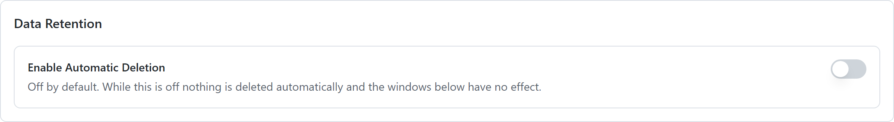
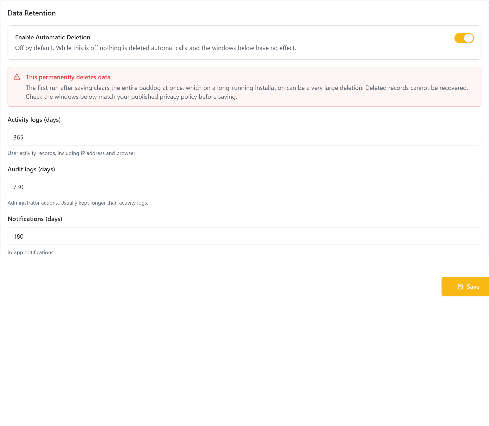
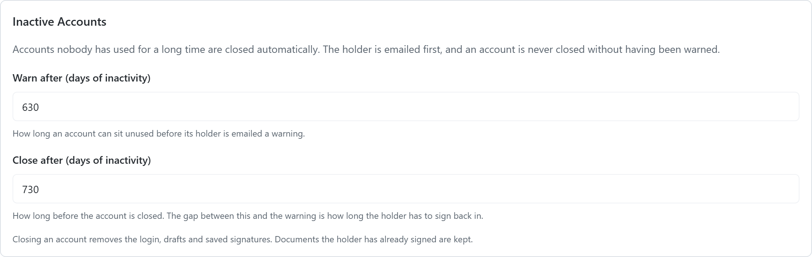

# Data Retention

**GDPR Article 5(1)(e) says personal data may be kept only as long as it is needed.** This page describes what vScrawl keeps, what it deletes, and what you must currently do yourself.

## The short version

!!! warning ""
    **Automatic deletion ships switched off.** Until an administrator turns it on, nothing is deleted on a schedule and every IP address, browser user agent, approximate location, name and email ever written to the logs stays where it is.

    That default is deliberate — an upgrade must never start deleting data on its own — but it does mean **doing nothing leaves you non-compliant**. Storage limitation is not optional under GDPR Art. 5(1)(e).

Turn it on at **Configurations → Retention**. The rest of this page explains what it covers and what it deliberately does not.

## What is deleted, and when

Deletion happens only when a person or an administrator triggers it.

| Trigger | What is removed |
| --- | --- |
| **A user deletes their account** (Settings → Delete Account) | Their Keycloak login, draft documents, incomplete self-signed documents, their recipient entries, form fields, inbox items, invitations, signature certificates and signing keys. Documents already sent are set to **Void**. |
| **An administrator deletes a user** (Customers → Users) | The same path. |
| **The last member of an organization leaves** | The organization itself, its templates, its documents and its credit history. |
| **A user deletes a signature or stamp** | That image only. |

### What survives a deletion

| Survives | Why |
| --- | --- |
| Their name on documents they have already signed | **Correct and deliberate.** Signed documents are evidence; other parties rely on them, and the law requires them kept. |
| The consent record for those signatures | **Correct.** Evidence of a signature is worthless without it. |
| The record that an identity check happened, for an issued certificate | **Correct.** It sits behind every signature made with that certificate — the identifiers themselves are removed. |

Everything else is now handled automatically. Deleting an account:

- Replaces the name, username and email on their platform record with anonymized values
- Removes their name from activity and audit entries, and replaces the email with a code that still shows two entries were the same person without saying who
- Masks the IP addresses, and clears the city and coordinates while keeping the country
- Deletes qualified certificate requests that never produced a certificate, and strips the passport number, date and place of birth and mother's maiden name from ones that did

!!! note ""
    Log rows are **anonymized rather than removed**. Deleting them outright would leave holes in the audit trail, and a missing entry cannot be told apart from one that was never written. Taking the person out of the row keeps the trail continuous.

    Entries recording an **administrator's** action keep that administrator's own name and address. They are a different person, and that is the accountability record for privileged actions.

### Identity documents

The scan of an applicant's identity document is the most damaging single field the platform holds. It is now **discarded automatically as soon as the request is reviewed** — approved or rejected — keeping only which kind of document was checked and the decision.

!!! note ""
    A consequence worth knowing: an administrator can no longer re-open the document of an already-reviewed request. That is the intended trade-off, but it means the review has to be done properly the first time.

!!! warning ""
    Requests reviewed **before this behaviour existed** may still hold their scan. Ask your database administrator to clear the stored images on already-reviewed rows once, as a one-off.

## Deciding your retention periods

These are business and legal decisions, not technical ones. They depend on your jurisdiction and your contracts, so take advice rather than adopting a default. As a starting point for that conversation:

| Data | Typical range | Consideration |
| --- | --- | --- |
| Completed signed documents | Long — often 10 years | This is the value your customers paid for. Deleting too early destroys it. |
| Draft documents never sent | Short — months | Abandoned work |
| Documents sent but never completed | Around a year, then void | The sender can always resend |
| Activity logs | Around a year | Long enough to investigate an incident |
| Audit logs of administrator actions | Longer than activity logs | Privileged actions deserve more scrutiny |
| Derived location data | Much shorter than the log row it sits on | The most intrusive field, with the weakest justification |
| Inactive accounts | Around two years, with a warning first | Never close an account silently |
| Billing records | Set by tax law, not by you | Usually overrides a deletion request |

!!! note ""
    Whatever you choose, **write it down and publish it in your Privacy Policy**. Articles 13 and 14 require you to tell people how long you keep their data. "Indefinitely" is not an acceptable answer, and neither is silence.

## Turning it on

When you first open the tab, only the master switch is there — the windows appear
once it is on, because while it is off they have no effect.



1. Open **Configurations → Retention** in the admin console.
2. Switch on **Enable Automatic Deletion**. A warning appears — read it.
3. Review each window and set it to match **what your published Privacy Policy says**. If the two disagree, the policy is a claim the platform does not honour.
4. Click **Save**.

!!! warning ""
    **The first run clears the entire backlog at once.** On an installation that has been collecting logs for years, that first sweep can be a very large deletion, and none of it can be recovered.

    Do it outside working hours, and take a database backup first.

The sweep then runs once a day at 02:30 UTC — see [Changing when the jobs run](#changing-when-the-jobs-run). Each run writes a summary to the [Audit Logs](../other_admin_operations/audit_logs.md) — the entry type is `RETENTION_PURGE` — including runs that deleted nothing, so you can always confirm the job is still alive.

## What it covers



| Setting | What it deletes |
| --- | --- |
| Activity logs | End-user activity records, including IP address and browser |
| Audit logs | Administrator action records |
| Notifications | In-app notifications |
| Rejected certificate requests | Identity verification data from requests that were rejected |
| Expired tokens and links | Old session tokens, invitation links, password-reset codes |
| Webhook delivery records | The record of each callback sent to a customer endpoint, including its payload |

!!! note ""
    **Signed documents are never deleted by this policy.** Deleting a customer's signed document is irreversible, and the product does not yet warn a user before it happens. Document retention stays a manual decision — see the periods discussed above.

## Inactive accounts

An account nobody has used for a long time is closed automatically. This is separate from the row-level cleanup above and runs at 03:00 UTC.

| Setting | What it does |
| --- | --- |
| **Warn after** | How long an account can sit unused before its holder is emailed |
| **Close after** | How long before the account is closed. The gap between the two is the holder's grace period |



**An account is never closed without having been warned.** If one reaches the closure threshold but no warning was ever sent — which is what happens the first time you enable this on an installation with years of dormant accounts — the sweep sends the warning and leaves the account alone until a later run.

The warning goes out by **email**, because the only person who needs to see it has not opened the product in over a year and would never notice an in-app message. An in-app notification is written too, and that notification doubles as the record that the warning was sent.

Closing an account runs the same path as a user deleting their own account: the login, drafts, saved signatures and keys go; **documents they have already signed stay**. Every closure is recorded in the [Audit Logs](../other_admin_operations/audit_logs.md) as `ACCOUNT_CLOSED_INACTIVE`.

!!! note ""
    Two cases are skipped on purpose, and both appear in the log rather than failing silently:

    - **An account with no email address** cannot be warned, so it is never closed either.
    - **An organization owner with other members** cannot be deleted — their organization would lose its owner. Transfer ownership first if you want the account closed.

Windows must be between **7 and 3650 days**. Anything shorter is refused: a window of zero would mean "delete everything older than right now", which on the activity log is every row you have.

If a setting is somehow missing or unreadable, the platform keeps the data for ten years rather than deleting it. Every failure mode errs towards keeping.

## Backups

Retention applies to backups too, and this is routinely forgotten.

- Know your backup schedule, how long each backup is kept, and where it is stored.
- Backups need the same protection as production: encryption, access control, and a defined destruction point.
- When you erase someone's data, it will persist in backups until those backups expire. The accepted approach is to say so, guarantee that the data is not restored into production, and re-apply the erasure if a restore ever happens.

## Accounts that are never touched by the schedule

Two things are never deleted by age alone, whatever you set the windows to:

- **A signing link that is still live.** Link codes are cleaned up on the token window, but a recipient's access to a document still waiting for them is left alone however old it is. Deleting it would revoke a signer's access to a live document.
- **A session whose refresh token has not expired.** Token rows are judged by their own recorded lifetime, not by their age, so shortening the token window cannot sign people out.

## Changing when the jobs run

Both jobs are scheduled from the service configuration, not from this console. The entries are in
`vscrawl-admin-service/config/application.yml`, written out with their defaults so you can find and
change them:

| Setting | Environment variable | Default | Controls |
| --- | --- | --- | --- |
| `retention.scheduler.cron` | `RETENTION_CRON` | `0 30 2 * * *` | When aged rows are deleted |
| `retention.scheduler.zone` | `RETENTION_TIMEZONE` | `UTC` | The clock **both** jobs are read against |
| `retention.inactive-accounts.cron` | `RETENTION_INACTIVE_ACCOUNTS_CRON` | `0 0 3 * * *` | When dormant accounts are warned and closed |

There is **one time zone for both jobs**, on purpose: two retention jobs on the same server running
against different clocks is a way to be surprised, not a feature.

The format is Spring's six-field cron — `second minute hour day-of-month month day-of-week`:

```
0 30 2 * * *      02:30 every day  (the default)
0 0 1 * * *       01:00 every day
0 0 3 * * SUN     03:00 on Sundays
```

To run at 01:00 Pakistan time:

```yaml
retention:
  scheduler:
    cron: "0 0 1 * * *"
    zone: "Asia/Karachi"
```

A restart is needed for the change to take effect.

!!! note ""
    **A bad cron expression stops the service starting.** That is deliberate: it fails in front of
    whoever deployed it, with the offending value named in the log, rather than leaving a job that
    silently never runs. Check the service comes up after changing it.

    The same applies to the time zone — an unknown zone name stops start-up too.

    Note that a **five-field** cron (the Unix style, `30 2 * * *`) is rejected. Spring uses six
    fields, seconds first.

!!! warning ""
    **Two values switch a job off rather than scheduling it.**

    | Value | Effect |
    | --- | --- |
    | `-` | Turns that job off. This is Spring's own token for a disabled schedule — use it if you deliberately want no sweep on this installation |
    | *(empty)* | **Also turns it off — silently.** Nothing is logged, and the service starts normally |

    So leaving `cron:` blank is the same as switching retention off, with nothing to tell you. If you
    want the default, delete the line rather than emptying it.

!!! warning ""
    **These are not in the admin console, and that is not an oversight.** A cron expression is a
    deployment decision — it depends on when your installation is quiet — and a wrong one should be
    caught at start-up, not saved from a settings screen. An administrator cannot change the
    schedule; whoever owns the deployment can.

## Account deletion is a separate setting

This page covers data deleted **by age, on a schedule**. How much is erased when somebody deletes
their own account is a different switch, on a different screen:
**Configurations → Privacy → Account deletion**. See
[Privacy Policy](../other_admin_operations/privacy_policy.md#account-deletion).

## Related

- [GDPR Overview](gdpr_overview.md)
- [Data Subject Requests](data_subject_requests.md)
- [Activity Logs](../other_admin_operations/activity_logs.md) · [Audit Logs](../other_admin_operations/audit_logs.md)
