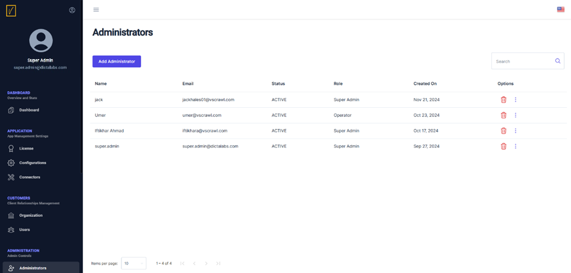
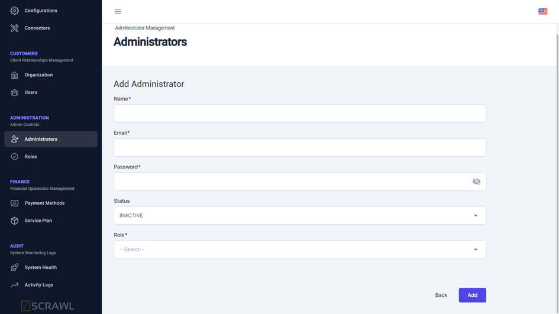

# Add a New Administrator

**Access the Administrators Page**  
Click on **Administrators** in the left navigation pane to view the list of existing administrators.

**Manage Existing Administrators**  
- To delete an existing administrator, click the trash icon next to their name.  
- To update an existing administrator, click the three dots and select **Update Administrator**.

**Add a New Administrator**  
Click on the **Add Administrator** button to open the screen for creating a new administrator.

**Provide Administrator Details**  
- Enter the **Name**, **Email**, and **Password** for the new administrator.  
- Set the **Status** to **Active**.  
- Choose the desired **Role** from the dropdown menu.  

> **Tip:** Assign a role that matches the responsibilities of the new administrator to ensure proper access control. 
