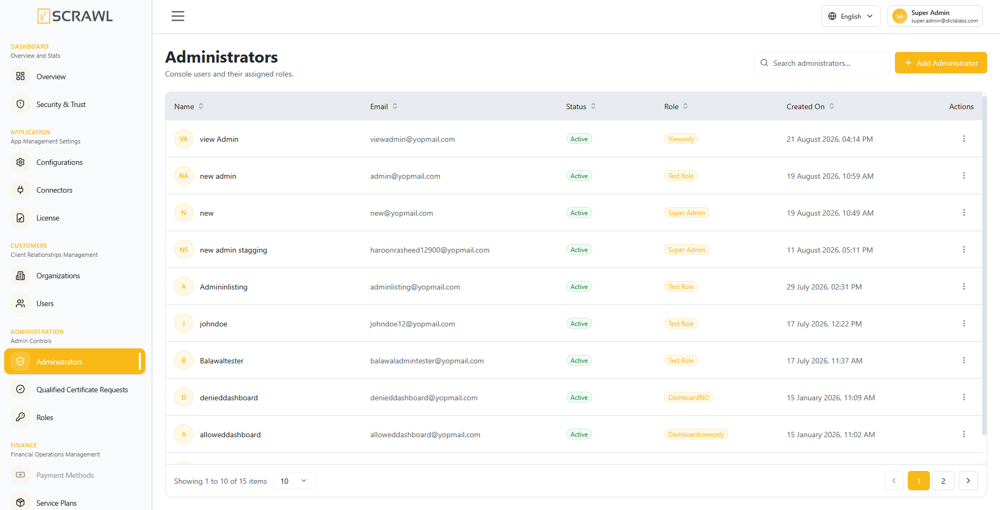
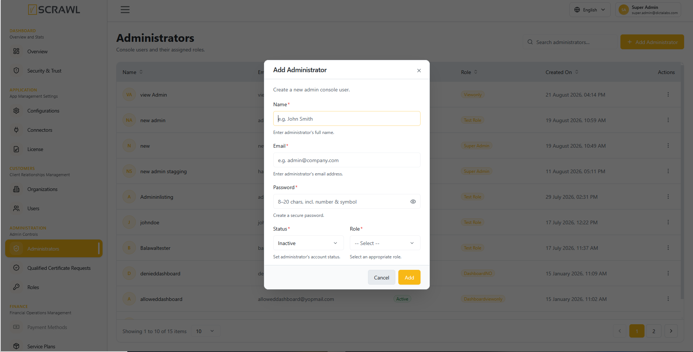

# Add a New Administrator

**Access the Administrators Page**  
Click on **Administrators** under **Administration** in the left navigation pane to view the list of existing administrators.

**Manage Existing Administrators**  

- To update an existing administrator, open the three-dot menu in the **Actions** column of that administrator and select **Edit administrator**. You can change the name, status and role, and set a new password. The email address cannot be changed, and leaving **Password (leave blank to keep)** empty keeps the current password. When editing, **Disabled** is also available as a status.  
- To delete an existing administrator, select **Delete administrator** from the same menu and confirm.

**Add a New Administrator**  
Click on the **Add Administrator** button to open the screen for creating a new administrator.

**Provide Administrator Details**  

- Enter the **Name**, **Email**, and **Password** for the new administrator. The name must be 3 to 20 characters long and contain only letters and single spaces, and the email address must not already belong to another administrator.  
- The **Password** must be 8 to 20 characters long and contain an upper-case letter, a lower-case letter, a digit and one of the special characters `@ $ ! % * ? &`.  
- Set the **Status** to **Active**. A new administrator starts as **Inactive**.  
- Choose the desired **Role** from the dropdown menu. Only **Active** roles are listed.  
- Click **Add** to create the administrator.  

> **Tip:** Assign a role that matches the responsibilities of the new administrator to ensure proper access control. 
