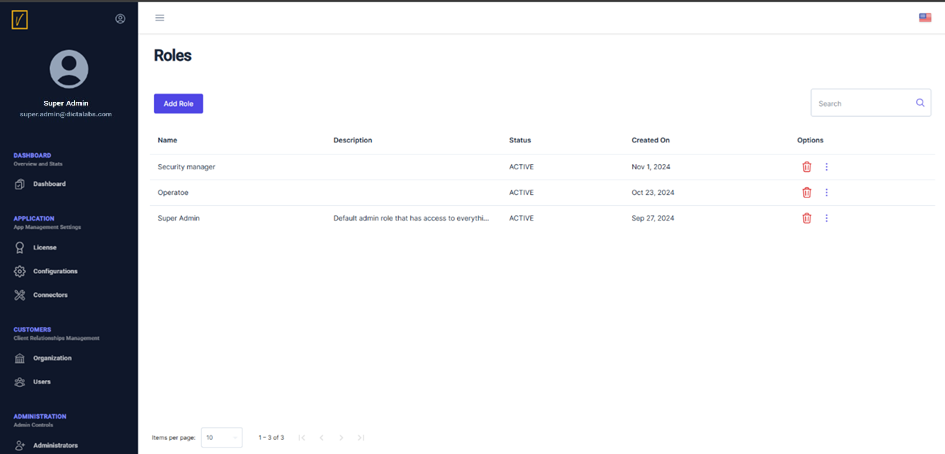
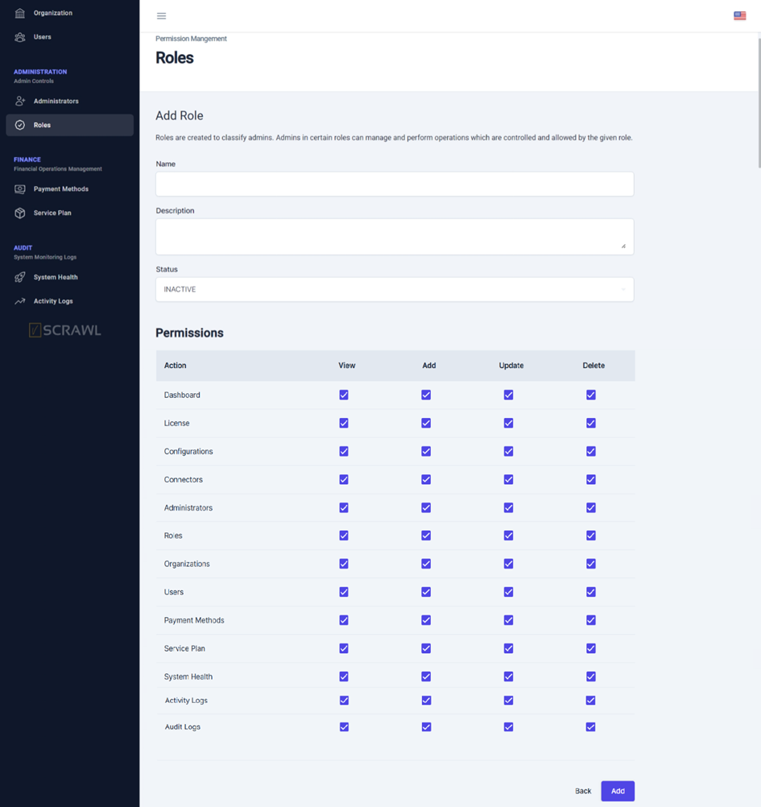

# Create a New Role

**Access the Roles Page**  
   From the left navigation pane, click on **Roles** to see a list of roles.  
   - You can delete an existing role or modify it by clicking the three dots next to the role and selecting **Update Role**.  

   

**Add a New Role**  
   Click on **Add Role** to create a new role using the screen shown below.

   

**Define Role Details**  
   - Assign the new role a **name** and **description**.  
   - Set the role's status to **Active**.  
   - Configure permissions by selecting the relevant checkboxes to allow **View**, **Add**, **Update**, or **Delete** operations for specific modules.  

   > **Tip:** You can create roles with access limited to specific modules. For example, a role might only administer certain modules, depending on business requirements.

**Avoid Faulty Configurations**  
   While creating a new role, ensure proper configurations:  
   - Do not allow **Add**, **Update**, or **Delete** access to a module without also providing **Read** access.  
   - Such configurations can result in errors and must be avoided. 
