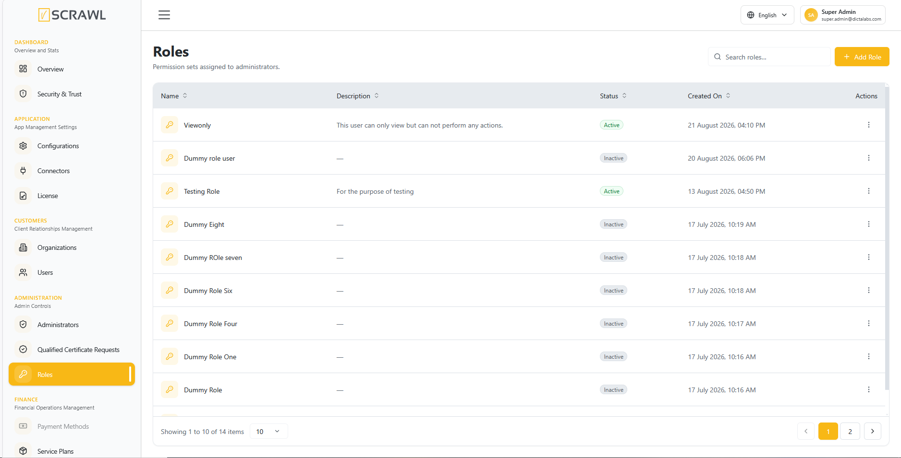
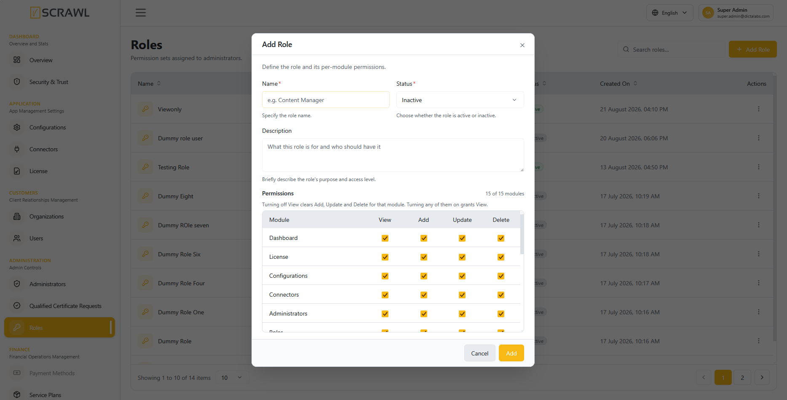

# Create a New Role

**Access the Roles Page**  
   From the left navigation pane, under **Administration**, click on **Roles** to see a list of roles.  

   - To modify an existing role, open the three-dot menu in the **Actions** column of that role and select **Edit role**. To delete it, select **Delete role** from the same menu.  
   - A role that is assigned to an administrator cannot be deleted, and cannot be set to **Inactive** or **Disabled**. Move its administrators to another role first.  

   

**Add a New Role**  
   Click on **Add Role** to create a new role using the screen shown below.

   

**Define Role Details**  

   - Assign the new role a **Name** and, optionally, a **Description** (up to 255 characters). The name must be unique, 3 to 20 characters long, and contain only letters and single spaces. It cannot be changed after the role is created.  
   - Set the role's **Status** to **Active**. A new role starts as **Inactive**, and only **Active** roles can be assigned to administrators.  
   - Configure permissions by selecting the relevant checkboxes to allow **View**, **Add**, **Update**, or **Delete** operations for each module. For a new role every checkbox starts selected, so clear the ones the role should not have. At least one permission must remain selected.  
   - Click **Add** to create the role.  

   > **Tip:** You can create roles with access limited to specific modules. For example, a role might only administer certain modules, depending on business requirements.

**How Permissions Are Applied**  
   The permission table keeps each module's rights consistent for you:  

   - Turning off **View** for a module also clears **Add**, **Update** and **Delete** for it. Turning on any of those three also turns on **View**.  
   - A module without **View** is hidden from the left navigation pane. Opening its screen directly shows *You don't have access to this screen*.  
   - Without **Add**, **Update** or **Delete**, the matching buttons and menu entries on that module's screen are hidden.  
   - The **Security & Trust** screen is controlled by the **System Health** module, and the **Qualified Certificate Requests** screen by the **Roles** module. 
