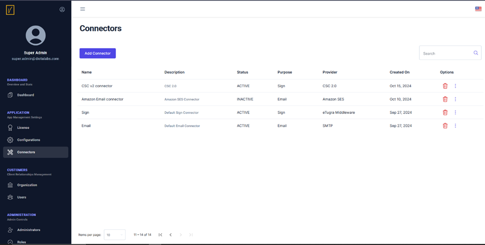
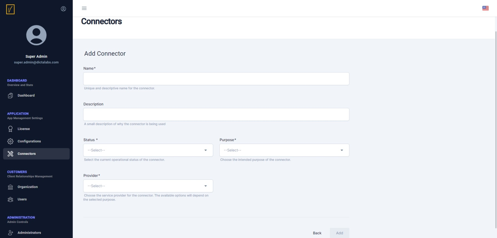
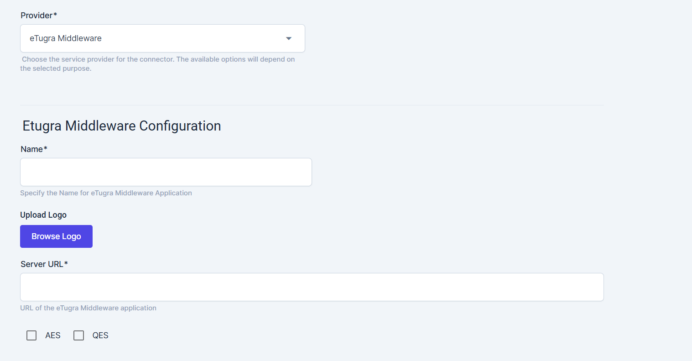
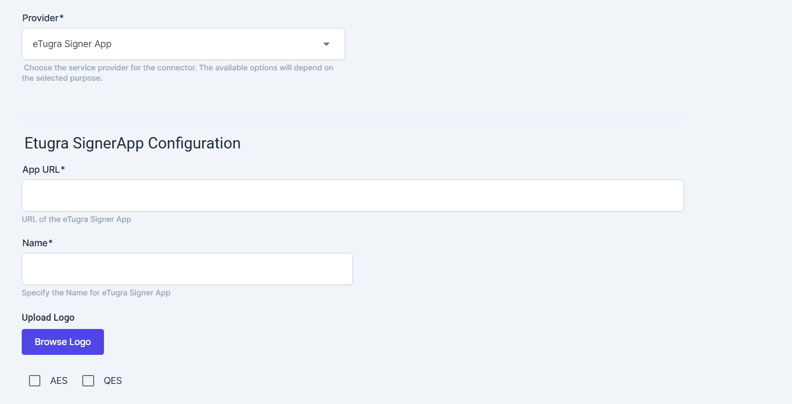
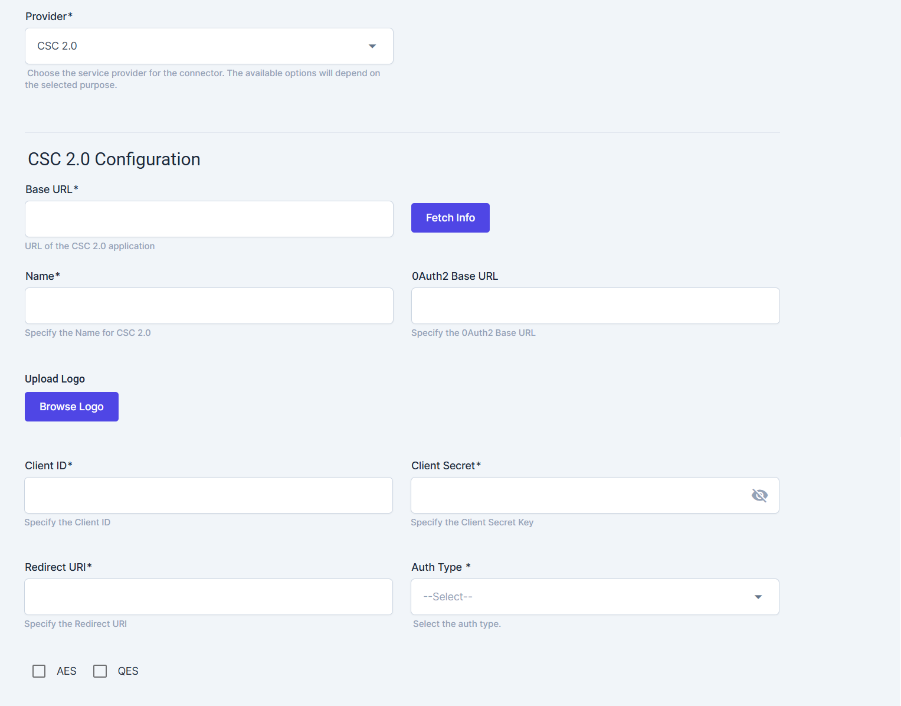
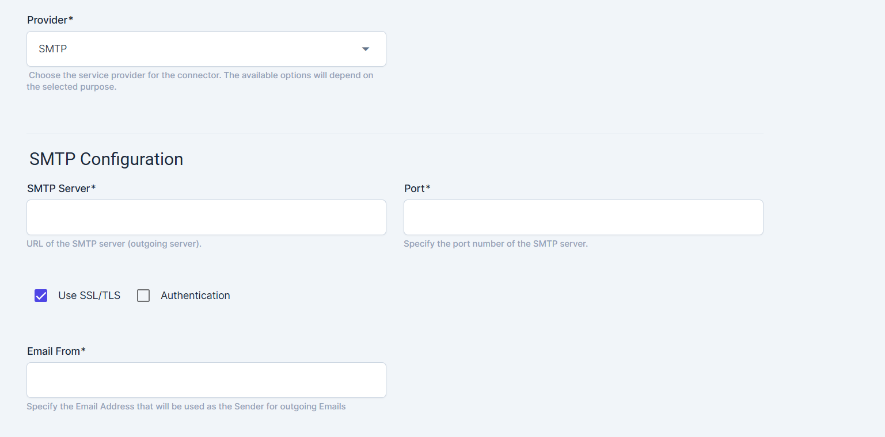
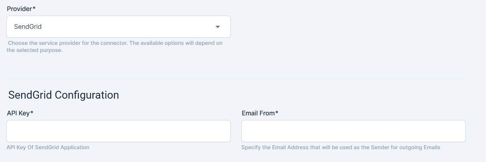
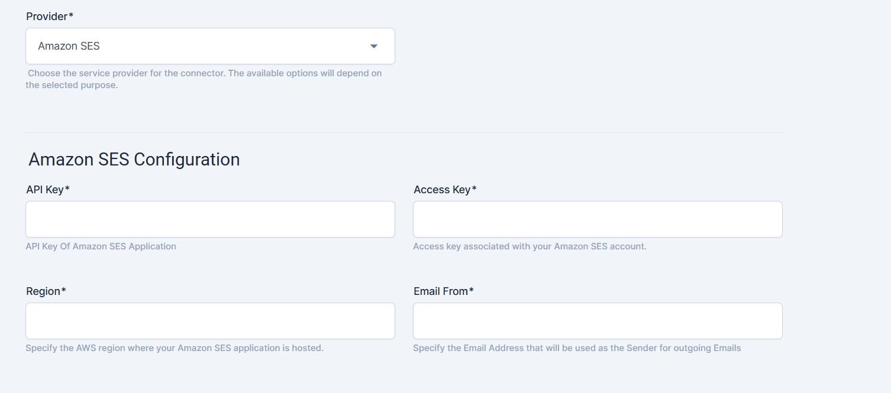
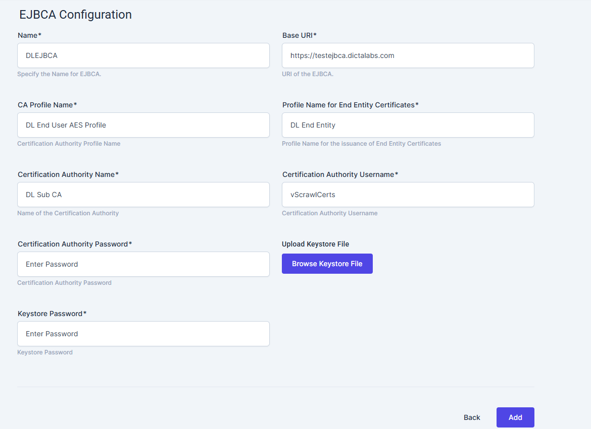

# Add Connectors

As part of configuring the system for the first time, the next step is to add external connectors.

vScrawl can manage electronic signatures and advanced electronic signatures (AES) within the application. However, for **qualified electronic signatures (QES)**—remote digital signatures—vScrawl relies on an external **Trusted Service Provider (TSP)**. To enable this functionality, a connector must be defined.

Additionally, connectors are required for email server configurations to manage email notifications.

---

## Access the Connectors Page  
To get started, navigate to the **Connectors** section in the left-hand navigation pane to view the list of existing connectors.

---

## Add a New Connector  
Click on the **Add Connector** button to open the connector creation screen.

---

## Provide Connector Details  
- **Name**: Enter a unique name for the connector.  
- **Description**: Provide a brief description to help identify the connector's purpose.  
- **Status**: Set the status to either **Active** or **Inactive**.  
- **Purpose**: Select the purpose from the following options:  
  - **Email**  
  - **Sign**  

---

## Connector Options  

### **Sign Connectors**  
These connectors facilitate digital signing. Choose the appropriate signing method and configure the settings:

####eTugra Middleware  
   Use this connector for remote signing with eTugra Middleware as an external TSP.  

   - **Configuration**:  
     - Provide a name for the eTugra Middleware application.  
     - Upload a logo for the application.  
     - Enter the server URL for eTugra Middleware.  
     - Select the signing options: **AES**, **QES**, or both.  

   - **Example Configuration Screen**:  
     

####eTugra Signer App  
   Use this connector for local signing with user keys on a smart card or USB dongle.  

   - **Configuration**:  
     - Enter the application name and URL.  
     - Upload a logo for the application.  
     - Select the signing options: **AES**, **QES**, or both.  

   - **Example Configuration Screen**:  
     

####CSC 2.0  
   A Cloud Signature Consortium (CSC) 2.0-compliant solution for remote signing.  

   - **Configuration**:  
     - Enter the Base URL provided by your TSP administrator and click **Fetch Info** to automatically populate the Name and OAuth2 Base URL fields.  
     - Upload a logo for the connector.  
     - Configure the Client ID and Client Secret as provided by the TSP administrator.
	 - Configure the Redirect URI to same value as you used to register with your TSP.
     - Select the authentication type: **oauth2code** or **oauth2client**.  
     - Select the signing options: **AES**, **QES**, or both.  

   - **Example Configuration Screen**:  
     

---

### **Email Connectors**  
These connectors enable email notifications. Select the email service provider and configure the settings:

####SMTP  
   Use this connector to send emails via your organization's mail server.  

   - **Configuration**:  
     - Enter the SMTP Server name and port.  
     - Choose the authentication mechanism.  
     - Provide a "From" email address.  

   - **Example Configuration Screen**:  
     

####SendGrid  
   Use this connector for cloud-based email delivery with SendGrid.  

   - **Configuration**:  
     - Enter the SendGrid API Key.  
     - Provide a "From" email address.  

   - **Example Configuration Screen**:  
     

####Amazon SES  
   Use this connector for scalable email sending with Amazon SES.  

   - **Configuration**:  
     - Enter the API Key and Access Key.  
     - Specify the region for the SES service.  
     - Provide a "From" email address.  

   - **Example Configuration Screen**:  
     

---

### **Certification Authorities**  
These connectors enable vScrawl to communicate with the configured Certification Authorities to issue vScrawl signing user certificates.  Currently only EJBCA is supported.

####EJBCA  
   Use this connector to communicate with a pre-deployed EJBCA instance to issue user certificates.  

   - **Configuration**:  
     - Enter the EJBCA instance name and its base URI.  
     - Provide the CCA Profile Name (certificate profile) and End Entity Profile as configured on EJBCA.  
     - Provide the Certificate Authority (Issuing CA) name and corresponding username and password.
     - Browse for the keystore file to authenticate to the EJBCA and the keystore password.

   - **Example Configuration Screen**:  
     
---

> **Note:** Carefully select the connector type and configuration that best meets your organizational requirements for optimal operation.
