# Add Connectors

As part of configuring the system for the first time, the next step is to add external connectors.

vScrawl can manage electronic signatures and advanced electronic signatures (AES) within the application. However, for **qualified electronic signatures (QES)**—remote digital signatures—vScrawl relies on an external **Trusted Service Provider (TSP)**. To enable this functionality, a connector must be defined.

Additionally, connectors are required for email server configurations to manage email notifications, and for the **Time Stamping Authority (TSA)** used when signatures are timestamped.

---

## Access the Connectors Page  
To get started, navigate to the **Connectors** section in the left-hand navigation pane to view the list of existing connectors.

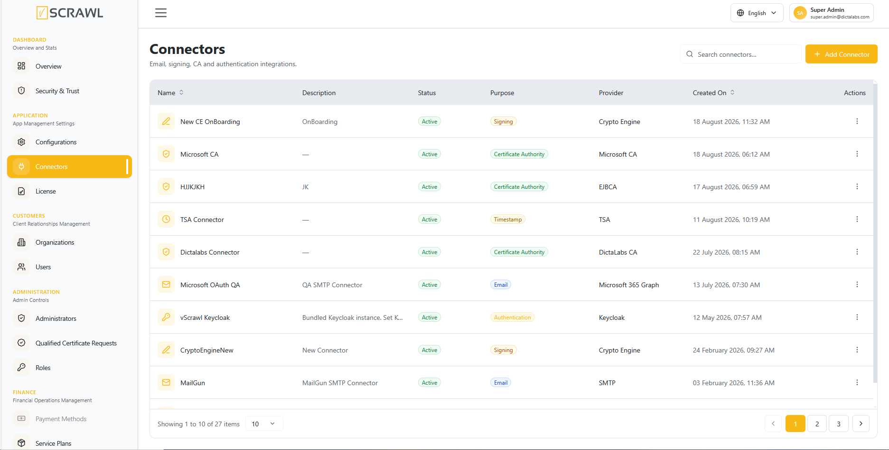

---

## Add a New Connector  
Click on the **Add Connector** button to open the connector creation screen.

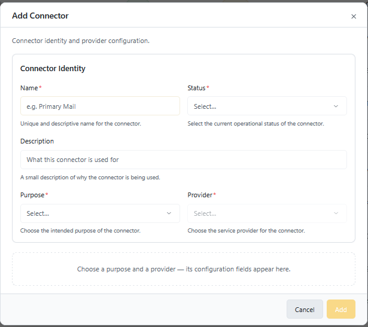

---

## Provide Connector Details  
- **Name**: Enter a unique name for the connector.  
- **Description**: Provide a brief description to help identify the connector's purpose.  
- **Status**: Set the status to either **Active** or **Inactive**.  
- **Purpose**: Select the purpose from the following options:  
  - **Email**  
  - **Sign**  
  - **Certification Authority**
  - **Auth**
  - **Timestamp**
  - **Storage**

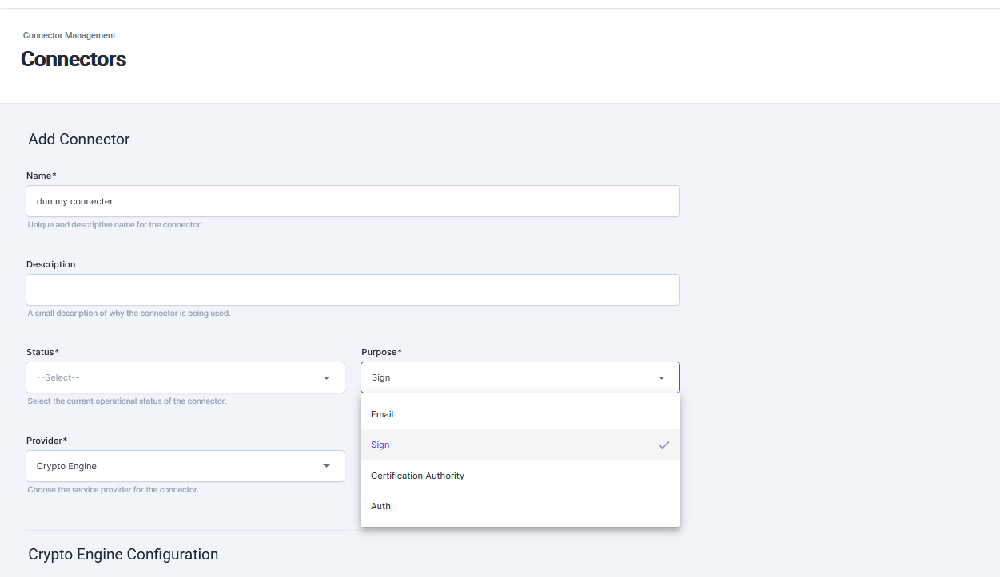

The **Provider** dropdown only lists the providers that belong to the purpose you selected, so always choose the Purpose first.

---

## Connector Options  

### **Sign Connectors**  
These connectors facilitate digital signing. Choose the appropriate signing method and configure the settings:

####eTugra Middleware  
   Use this connector for remote signing with eTugra Middleware as an external TSP.  

   - **Configuration**:  
     - Provide a name for the eTugra Middleware application.  
     - Upload a logo for the application.  
     - Enter the server URL for eTugra Middleware.  
     - Select the signing options: **AES**, **QES**, or both.  
     - Optionally toggle **Enable HSM Signing** to sign through a Hardware Security Module. When enabled, the **HSM Identifier** field becomes required.

   - **Example Configuration Screen**:  

     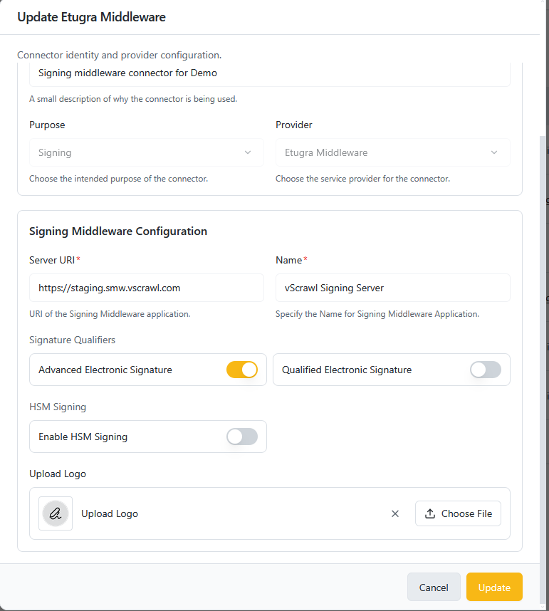

     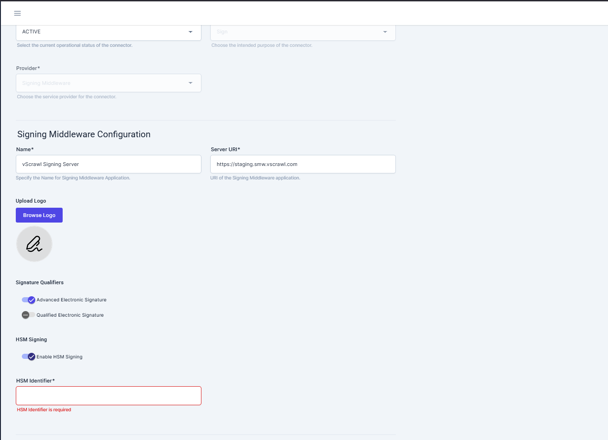

####eTugra Signer App  
   Use this connector for local signing with user keys on a smart card or USB dongle.  

   - **Configuration**:  
     - Enter the application name and URL.  
     - Upload a logo for the application.  
     - Select the signing options: **AES**, **QES**, or both.  

   - **Example Configuration Screen**:  

     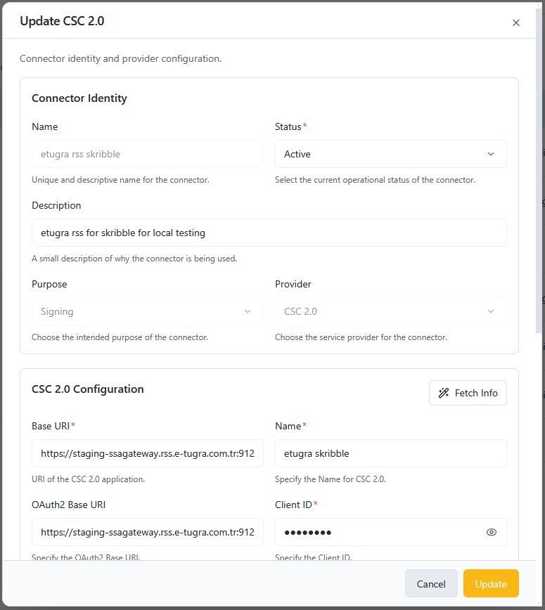

####CSC 2.0  
   A Cloud Signature Consortium (CSC) 2.0-compliant solution for remote signing.  

   - **Configuration**:  
     - Enter the Base URL provided by your TSP administrator and click **Fetch Info** to automatically populate the Name and OAuth2 Base URL fields.  
     - Upload a logo for the connector.  
     - Configure the Client ID and Client Secret as provided by the TSP administrator.
	 - Configure the Redirect URI to same value as you used to register with your TSP.
     - Select the authentication type: **oauth2code** or **oauth2client**.  
     - Select the signing options: **AES**, **QES**, or both.  

   - **Example Configuration Screen**:  

     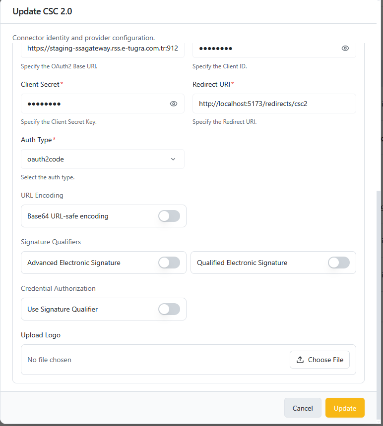

####Crypto Engine
   Use this connector for local signing backed by AWS KMS.

   - **Configuration**:
     - Enter a Name and the Crypto Engine's Base URI.
     - Provide the AWS KMS Client ID and Client Secret.
     - Provide a Store Name.
     - Optionally upload a logo.
     - Select the signature qualifiers: **Advanced Electronic Signature**, **Qualified Electronic Signature**, or both.

   - **Example Configuration Screen**:

     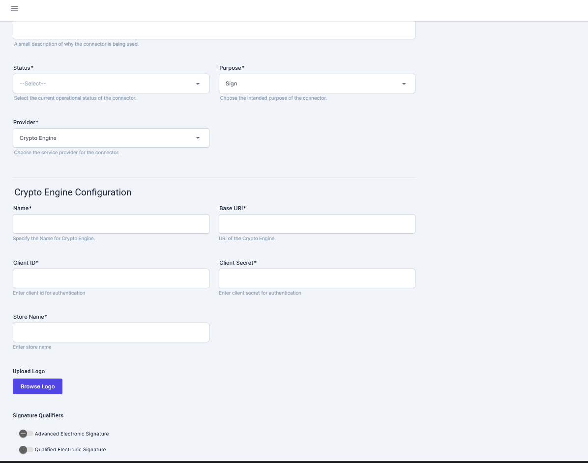

---

### **Email Connectors**  
These connectors enable email notifications. Select the email service provider and configure the settings:

####SMTP  
   Use this connector to send emails via your organization's mail server.  

   - **Configuration**:  
     - Enter the SMTP Server name and port.  
     - Choose the authentication mechanism.  
     - Provide a "From" email address.  

   - **Example Configuration Screen**:  

     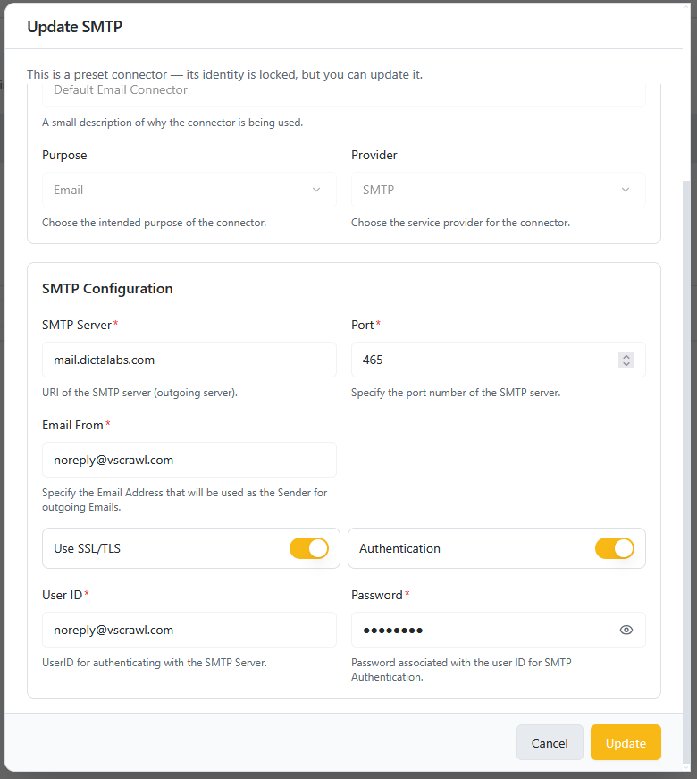

####SendGrid  
   Use this connector for cloud-based email delivery with SendGrid.  

   - **Configuration**:  
     - Enter the SendGrid API Key.  
     - Provide a "From" email address.  

   - **Example Configuration Screen**:  

     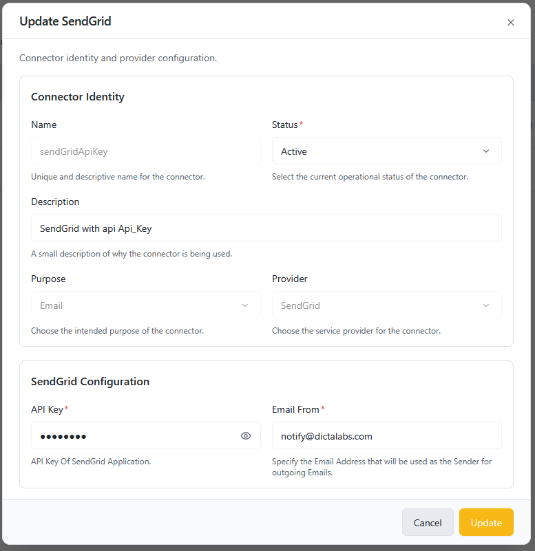

####Amazon SES  
   Use this connector for scalable email sending with Amazon SES.  

   - **Configuration**:  
     - Enter the API Key and Access Key.  
     - Specify the region for the SES service.  
     - Provide a "From" email address.  

   - **Example Configuration Screen**:  

     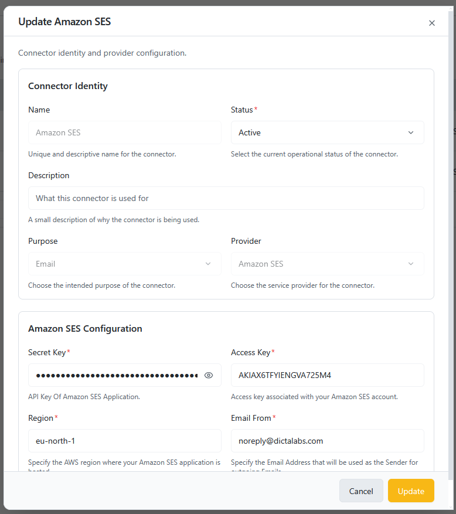

####Microsoft 365 Graph (Microsoft OAuth2)
   Use this connector to send email through a Microsoft 365 mailbox via the Microsoft Graph API.

   - **Configuration**:
     - Enter the Tenant ID and Client ID of the Microsoft Entra app registration.
     - Provide the Client Secret.
     - Provide the OAuth Scope (defaults to `https://graph.microsoft.com/.default`).
     - Provide the Email From address used as the sender for outgoing emails.
     - Click **Test Connection** to verify the configuration before saving.

   - **Example Configuration Screen**:

     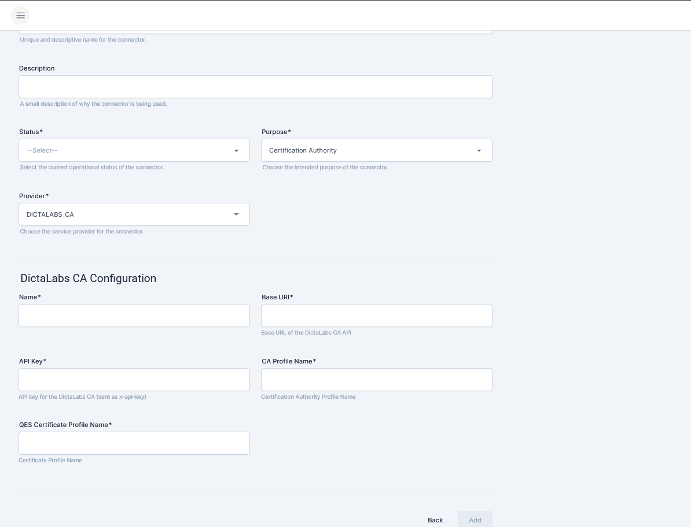

---

### **Certification Authorities**  
These connectors enable vScrawl to communicate with the configured Certification Authorities to issue vScrawl signing user certificates. Select **Certification Authority** as the Purpose, then choose a Provider: **EJBCA**, **DictaLabs CA** or **Microsoft CA**.

####EJBCA  
   Use this connector to communicate with a pre-deployed EJBCA instance to issue user certificates.  

   - **Configuration**:  
     - Enter the EJBCA instance name and its base URI.  
     - Provide the CCA Profile Name (certificate profile) and Profile Name for End Entity Certificates as configured on EJBCA.  
     - Provide the QES Certificate Profile Name.
     - Provide the Certificate Authority (Issuing CA) name and corresponding username and password.
     - Browse for the keystore file to authenticate to the EJBCA and the keystore password.

   - **Example Configuration Screen**:  

     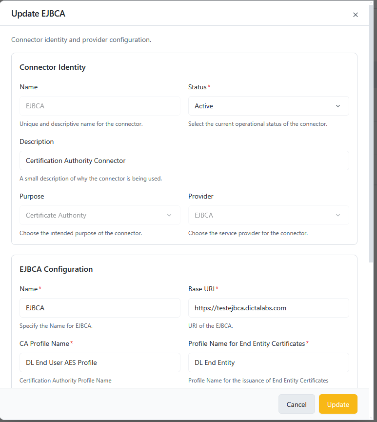

     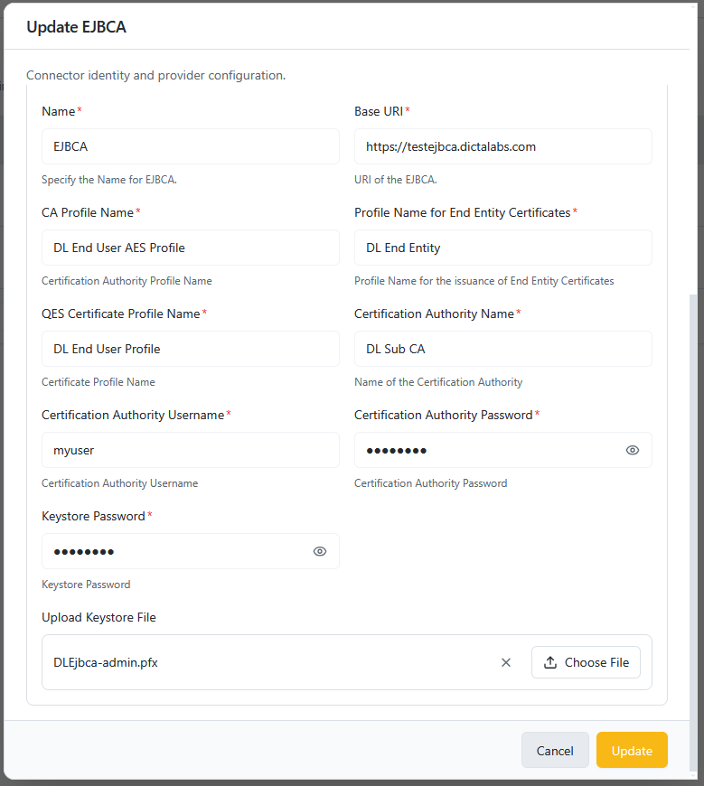

####DictaLabs CA
   Use this connector to issue certificates through DictaLabs' own Certification Authority.

   - **Configuration**:
     - Enter a Name and the Base URI of the DictaLabs CA API.
     - Provide the API Key (sent as `x-api-key`).
     - Provide the CA Profile Name (Certification Authority Profile Name).
     - Provide the QES Certificate Profile Name.

   - **Example Configuration Screen**:

     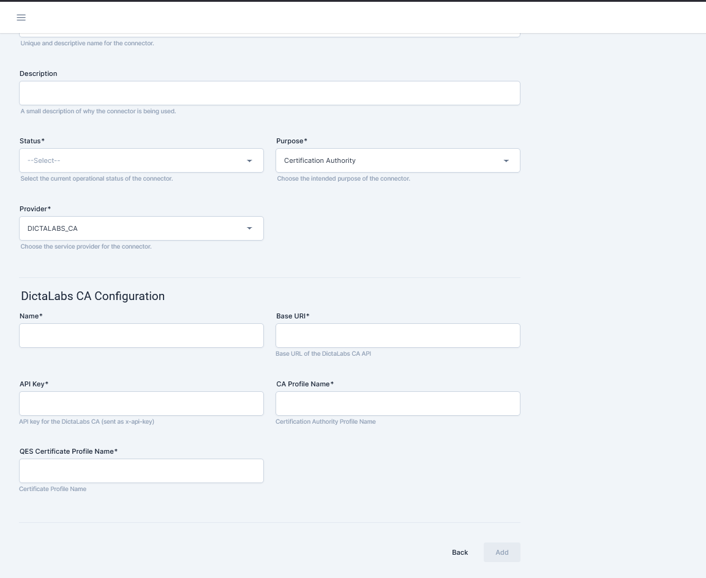

####Microsoft CA
   Use this connector to issue certificates from a Microsoft Active Directory Certificate Services
   (AD CS) Enterprise CA through its web enrollment application. Because AD CS rejects anonymous
   requests, vScrawl authenticates with domain credentials. It supports both **Windows (NTLM)** and
   **Basic** authentication and uses whichever the enrollment host offers, so no setting is needed
   here when the CA administrator changes that.

   - **Configuration**:
     - Enter a Name and the Enrollment URI of the AD CS host, including the port if it is not the
       default. vScrawl appends the `/certsrv` path itself, so entering it is optional.
     - Provide the Certificate Template — the exact internal template name used for the signing
       certificate, for example `AdvancedDocumentSigning`.
     - Provide the QES Certificate Template when onboarding runs through the **signing middleware**
       (Etugra Middleware) with remote signing enabled. That path issues a qualified certificate as
       well as an advanced one, and leaving this empty fails the whole onboarding — the user is
       created but receives no certificate. It is genuinely optional only on the **Crypto Engine**
       onboarding path, which issues a single certificate from the Certificate Template above.
     - Provide the Domain, Username and Password of a domain account that holds **Enroll** permission
       on the template. The username may be entered on its own, or as `DOMAIN\user` or `user@domain`.
     - Optionally provide the Target CA Name. vScrawl compares it against the CA that the enrollment
       host reports, which catches a host that has been re-pointed at a different CA.
     - Optionally switch on **Include Email as SAN** to add the signer's email address to the request
       as a subject alternative name. The CA must be configured to accept SAN attributes in requests,
       otherwise it ignores them.

   - **Example Configuration Screen**:

     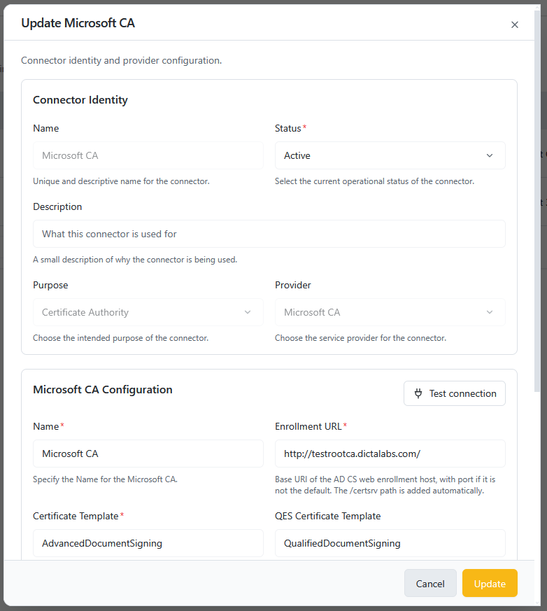

   - **Verifying the settings**: use **Test Connection** before saving. It authenticates against the
     enrollment host without submitting a certificate request, and reports separately whether the host
     was unreachable, the credentials were rejected, or web enrollment is not installed.

   - **Requirements on the CA**:
     - The **Certification Authority Web Enrollment** role must be installed. vScrawl enrols through
       the `/certsrv` pages; a CA without that role answers 404 and no certificate can be issued.
     - The certificate template must be configured with **Supply in the request** for the subject
       name. On *Build from Active Directory information* every issued certificate carries the
       service account's identity instead of the signer's.
     - The template must accept RSA-2048 keys, and must not require certificate-manager approval — an
       approval-gated template returns no certificate in-band, and onboarding fails.
     - The domain account must hold **Enroll** permission on every template named above, including
       the QES Certificate Template when one is configured.
     - Where the CA issues **qualified** certificates, the QES template itself has to assert the
       qcStatements extension. vScrawl does not add it to the request, and AD CS does not copy
       request extensions unless the CA is explicitly configured to.

   - **Transport security**: prefer an `https://` Enrollment URI. Over plain HTTP the issued
     certificate travels unencrypted, and if the host answers with Basic rather than Windows
     authentication the account password is effectively sent in the clear. vScrawl logs a warning
     each time it enrols over HTTP.

---

### **Auth Connectors**
These connectors let vScrawl delegate authentication to an external identity provider. Select **Auth** as the Purpose, then choose a Provider.

####Keycloak
   Use this connector to enable Single Sign-On via Keycloak. This connector must be configured before enabling Keycloak in [Authentication Settings](../other_admin_operations/authentication_settings.md).

   - **Configuration**:
     - Enter the Keycloak URL (base URL of the Keycloak server) and Realm name.
     - Provide the Client ID and Client Secret registered in the realm.
     - Provide the Admin Username and Admin Password for the Keycloak admin console.

   - **Example Configuration Screen**:

     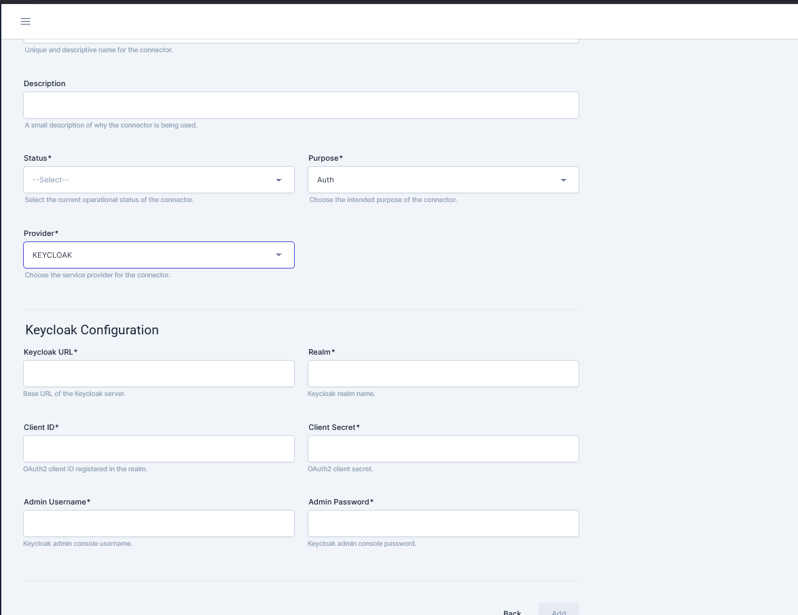

---

### **Timestamp Connectors**
These connectors point vScrawl at the **Time Stamping Authority (TSA)** server that issues the RFC 3161 timestamps embedded in signed documents. Select **Timestamp** as the Purpose, then choose the **TSA** Provider.

A Timestamp connector is only used when the signature is timestamped. After adding it here, select it in the **TSA Connector** dropdown on the [Signature Settings](../other_admin_operations/signature_settings.md) page — the timestamp URL and credentials are no longer entered on that page.

####TSA
   Use this connector for any RFC 3161 compliant Time Stamping Authority.

   - **Configuration**:
     - Enter the **Timestamp URL** of the TSA server.
     - Turn on **Authentication** only if the TSA server requires credentials. When it is off, the Username and Password fields are hidden and no credentials are sent.
     - When Authentication is on, provide the **Username** and **Password** issued to you by the TSA operator.

   - **Example Configuration Screen**:

     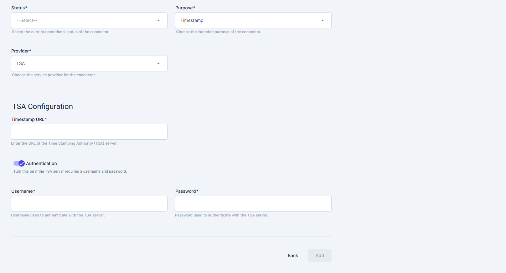

### **Storage Connectors**
These connectors decide **where document content is kept**. Select **Storage** as the Purpose, then choose a Provider.

Every storage location is a connector, including the platform's own volume — there is no separate "storage type" setting. After adding one here, select it as the **Default Storage** on the [Storage](../other_admin_operations/storage_settings.md) page.

> Google Drive and Dropbox connectors need an application registered with the provider first. See [Set Up Google Drive and Dropbox](storage_provider_setup.md) for what to create and which exact values to use.

> **Important:** Changing the Default Storage does not only affect new documents. Everything already stored is moved to the new connector in the background. Read [Changing the default moves what is already stored](../other_admin_operations/storage_settings.md#changing-the-default-moves-what-is-already-stored) before switching.

####Server Storage
   Documents are kept on the volume the platform itself runs on. This connector is created for you when vScrawl is installed, and is the default until you choose otherwise.

   - **Configuration**:
     - **Storage Location** — the root directory documents are written under. Leave it blank to use the installation's configured path.

   Adding a second Server Storage connector with a different Storage Location lets documents be moved onto a different volume.

####Google Drive
   Documents are kept in a folder of a connected Google account.

   - **Configuration**:
     - **Client ID** and **Client Secret** — the OAuth client of this connector's own Google Cloud project. Both are required; there is no shared application to fall back to, so two connectors can sit in two entirely different projects.
     - **OAuth Redirect URI** — this platform's storage callback endpoint, on the **API host** rather than the admin console's. Register this exact string with the connector's Google application: the provider checks it again during the token exchange, so one character of difference fails.
     - **Refresh Token** — written by Connect Account. A token only exists once Google has issued one, so it is not typed in.
     - **Root Folder ID** — appears only after the account is connected. Consent creates the folder and records it here.

   - **Example Configuration Screen**:

     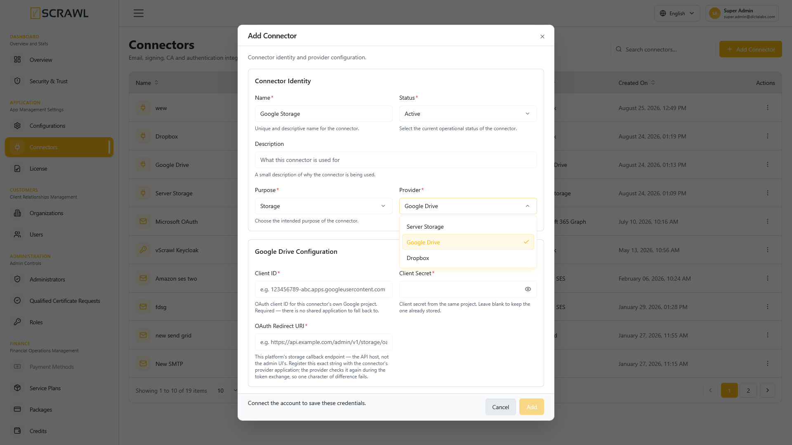

####Dropbox
   Documents are kept in a folder of a connected Dropbox account.

   - **Configuration**:
     - **App Key** and **App Secret** — from this connector's own scoped Dropbox app. Required, for the same reason as above.
     - **OAuth Redirect URI** — as for Google Drive, registered in the Dropbox App Console.
     - **Refresh Token** — written by Connect Account.
     - **Root Path** — appears only after the account is connected. Defaults to `/vscrawl`.
     - Grant the app the `account_info.read` permission **before** connecting if you want the Storage Usage figures reported. A token issued before that permission was granted cannot read them, and the panel simply omits the figures.

   - **Example Configuration Screen**:

     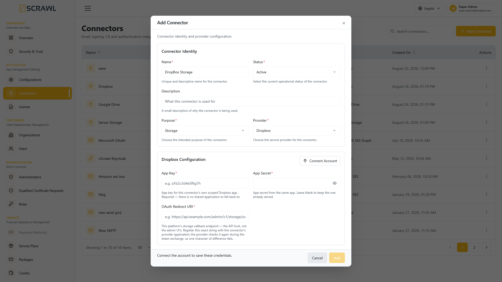

---

### Connect Account and Test Connection

Google Drive and Dropbox connectors need two things that credentials alone cannot provide: a **refresh token**, which only exists once the provider has issued one, and the **folder** to store in, which is created during the same consent.

- **Connect Account**, in the configuration section's header, creates or saves the connector, opens the provider's consent screen, and stores what comes back — the refresh token and the folder.
- Until it has been run, the dialog's **Add**/**Update** button stays disabled and the footer reads *"Connect the account to save these credentials."* A connector holding credentials but no token cannot store anything, and saving one would look successful while being unusable.
- Editing the Client ID, Client Secret, App Key or App Secret afterwards disables saving again until the account is reconnected: the stored token was issued to the old credentials and no longer belongs to the new ones.
- **Test Connection** proves the connector works end to end: it writes a small file, reads it back, and deletes it. The result and the time it took are shown, and are also what the Default Storage dropdown uses to decide whether to offer the connector at all.

> **Note:** A storage connector that still holds documents or templates **cannot be deleted**, and neither can the one currently set as the Default Storage. Deleting a connector does not delete the content — it deletes the only record of where the content is, and every read of it fails from that moment with nothing left to point at. Move the content elsewhere first by changing the Default Storage and letting the move finish.

---

> **Note:** Carefully select the connector type and configuration that best meets your organizational requirements for optimal operation.
