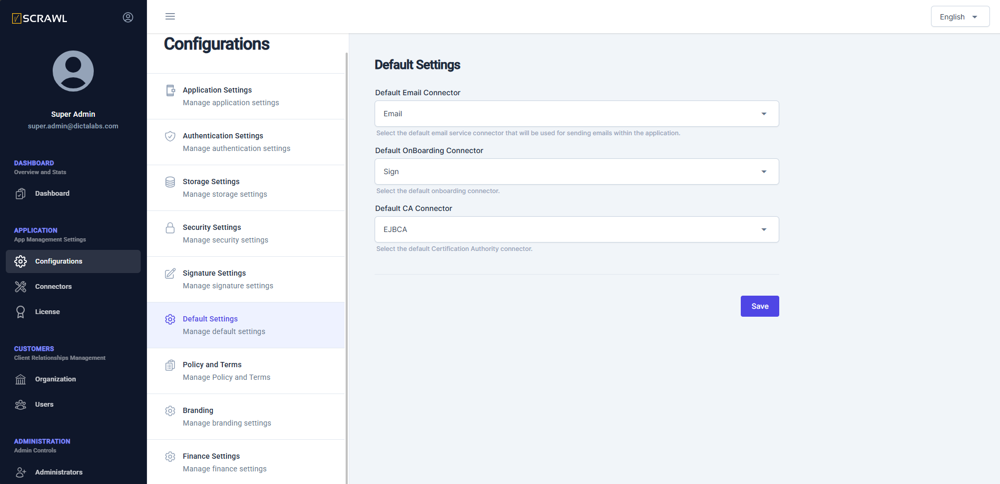

# Configure Connectors in Default Settings

In the previous section, we discussed adding external TSPs and other external components like the email server. From the list of configured connectors, the administrator can choose the default email connector and the default Signing Service Connector using the screen shown below:

In this screen, the administrator can select the default connectors for:

- **Default Email Connector**: Choose the default email connector to manage email notifications.

- **Default OnBoarding Connector**: Select the default onboarding connector for remote signatures. 
- **Default CA Connector**: Select the default Certification Authority connector.  Currently only EJBCA based CA connector is supported.
