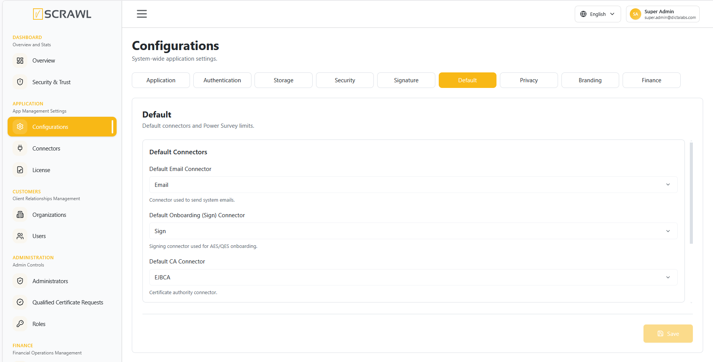
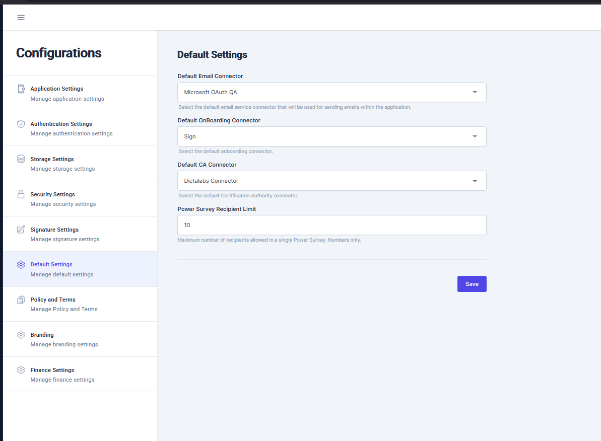

# Configure Connectors in Default Settings

In the previous section, we discussed adding external TSPs and other external components like the email server. From the list of configured connectors, the administrator can choose the default email connector and the default Signing Service Connector. Open **Configurations** under **Application** in the left navigation pane and select the **Default** tab, shown below:

In the **Default Connectors** section of this tab, the administrator can select the default connectors for:

- **Default Email Connector**: Choose the default email connector to manage email notifications.

- **Default Onboarding (Sign) Connector**: Select the signing connector used for AES/QES onboarding. Only **Signing** connectors using the **Etugra Middleware** or **Crypto Engine** providers appear in this dropdown.
- **Default CA Connector**: Select the default Certificate Authority connector, from any configured **EJBCA**, **DictaLabs CA** or **Microsoft CA** connector.
- **Default Storage**: chosen on the **Storage** tab rather than here, together with the space report for the volume it points at. See [Storage](../other_admin_operations/storage_settings.md).

Each dropdown lists only **Active** connectors of the matching purpose. The **Default Onboarding (Sign) Connector** and **Default CA Connector** appear only when your license enables eIDAS signing. A connector selected here cannot be deleted while it remains the default.

In the **Power Survey** section:

- **Recipient Limit**: Set the maximum number of recipients allowed in a single Power Survey (numbers only, at least 1). Leave blank to use the application default.

Click **Save** to apply the changes. The button stays disabled until something on the tab has changed, and switching to another tab or leaving the screen with unsaved changes asks you to confirm before they are discarded.

