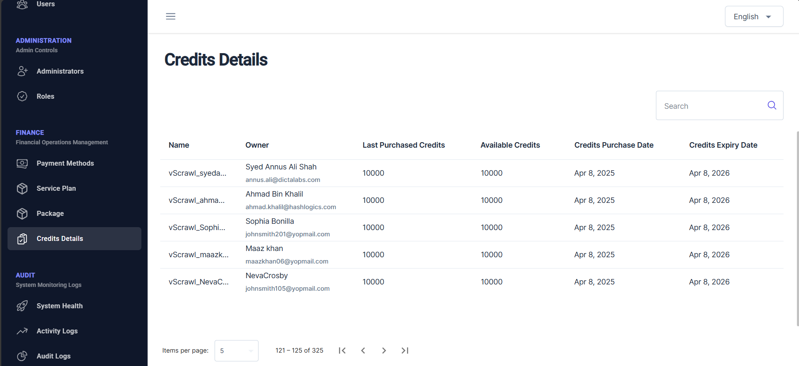

# Credit Details  

From the left navigation pane, click on **Credit Details** under **FINANCE** to open the Credit Details page.  

From this page, administrators can view a list of credit details as purchased by various vScrawl users.  These credits are allocated based on the service plan that is purchased by or is assigned to particular organization/user.  Details like **Last Purchased Credits**, **Available Credits**, **Credits Purchase Date** and **Credits Expiry Date** is shown.