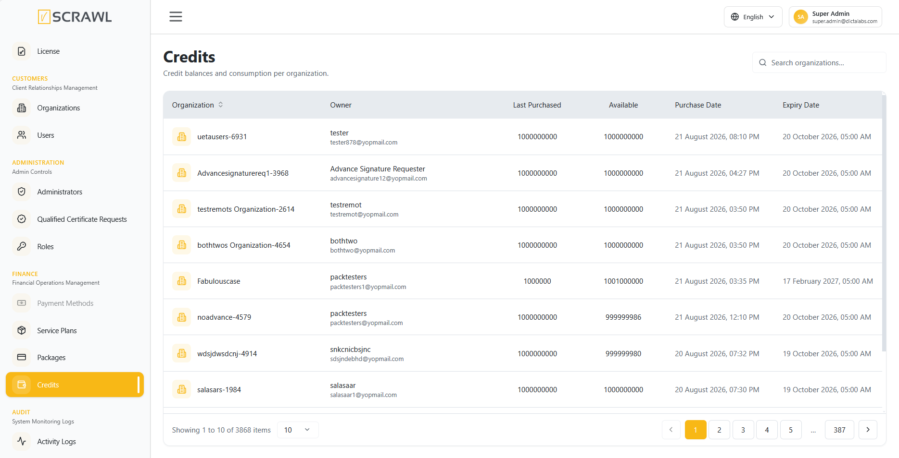

# Credit Details  

From the left navigation pane, click on **Credits** under **FINANCE** to open the Credits page.  

From this page, administrators can view the credit balance of each organization registered on vScrawl.  These credits are allocated based on the package — and through it the service plan — that is purchased by or is assigned to a particular organization.  Details like **Organization**, **Owner**, **Last Purchased**, **Available**, **Purchase Date** and **Expiry Date** are shown, and the list can be searched by organization.

The page is read-only. To renew or change an organization's package, use the **Actions** menu on the [Organization](../other_admin_operations/organization.md) screen.