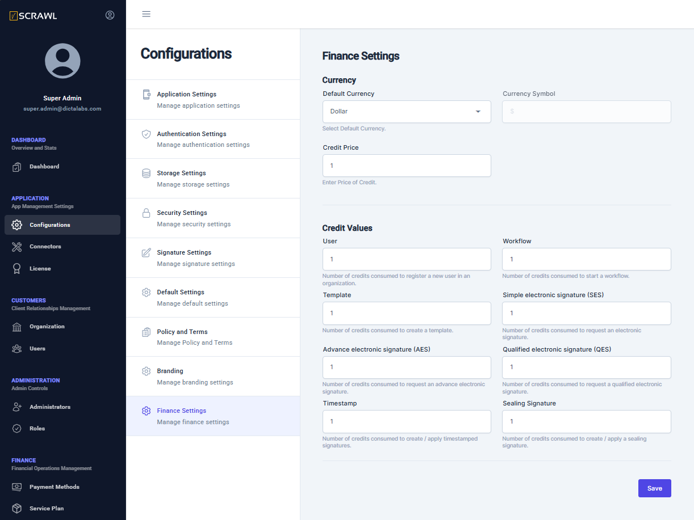

# Finance Settings  

Configure finance settings to ensure that registered organizations and signing users are billed correctly. The first step in this process is to define the charging currency and set up a pricing model for the different user operations within vScrawl.

From the left navigation pane, click on **Configurations** under **APPLICATION** and then in the Configurations sub-menu click on **Finance Settings**.  

From this screen, administrator can configure these:

- Choose currency in which the signing users should be assigned/purchasing a service plan and corresponding package.
- Enter price to be charged for each credit
- For various vScrawl user actions/operations choose the number of credits to be consumed for each of these:
	- New user registration
	- New workflow creation
	- New document template creation
	- Perform a simple electronic signature
	- Perform an advanced electronic signature
	- Perform a qualified electronic signature
	- Timestamp a document
	- Apply a sealing signature