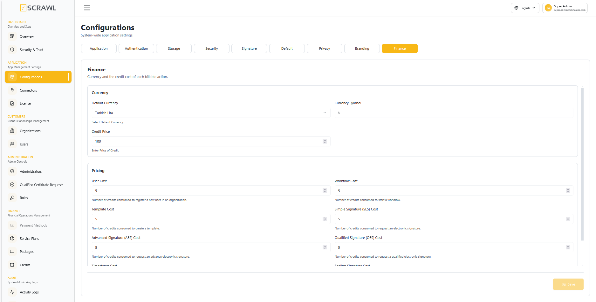

# Finance Settings  

Configure finance settings to ensure that registered organizations and signing users are billed correctly. The first step in this process is to define the charging currency and the price of a single credit, and then set up a pricing model that assigns a credit cost to each billable user operation within vScrawl.

From the left navigation pane, click on **Configurations** under **APPLICATION**, and then open the **Finance** tab on the Configurations page.  

From this screen, administrator can configure these:

- Choose currency in which the signing users should be assigned/purchasing a service plan and corresponding package.
- Enter price to be charged for each credit
- For various vScrawl user actions/operations choose the number of credits to be consumed for each of these:
	- New user registration
	- New workflow creation
	- New document template creation
	- Perform a simple electronic signature
	- Perform an advanced electronic signature
	- Perform a qualified electronic signature
	- Timestamp a document
	- Apply a sealing signature