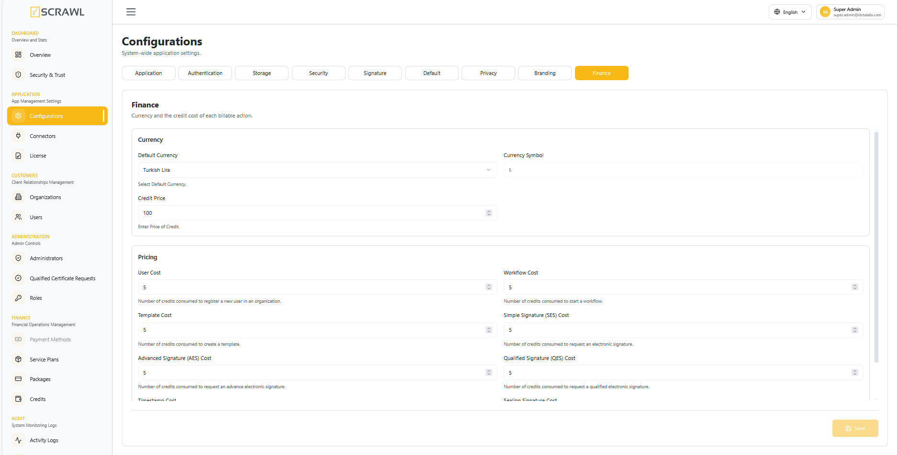

# Finance Settings  

Configure finance settings to ensure that registered organizations and signing users are billed correctly. The first step in this process is to define the charging currency and the price of a single credit, and then set up a pricing model that assigns a credit cost to each billable user operation within vScrawl.

From the left navigation pane, click on **Configurations** under **APPLICATION**, and then open the **Finance** tab on the Configurations page.  

From this screen, administrator can configure these:

- Choose the **Default Currency** in which the signing users should be assigned/purchasing a service plan and corresponding package. The **Currency Symbol** beside it is filled in from the selected currency and cannot be typed.
- Enter the **Credit Price** to be charged for each credit
- For various vScrawl user actions/operations, under **Pricing**, choose the number of credits to be consumed for each of these:
	- New user registration (**User Cost**)
	- New workflow creation (**Workflow Cost**)
	- New document template creation (**Template Cost**)
	- Perform a simple electronic signature (**Simple Signature (SES) Cost**)
	- Perform an advanced electronic signature (**Advanced Signature (AES) Cost**)
	- Perform a qualified electronic signature (**Qualified Signature (QES) Cost**)
	- Timestamp a document (**Timestamp Cost**)
	- Apply a sealing signature (**Sealing Signature Cost**)

Every field is required. The credit price and each cost must be a number between **0** and **1,000,000**; a field outside that range is marked and nothing is saved until it is corrected. Click **Save** to apply the changes.

> **Note:** Packages can only be created once a currency and credit price have been saved here — see [Package](package.md).