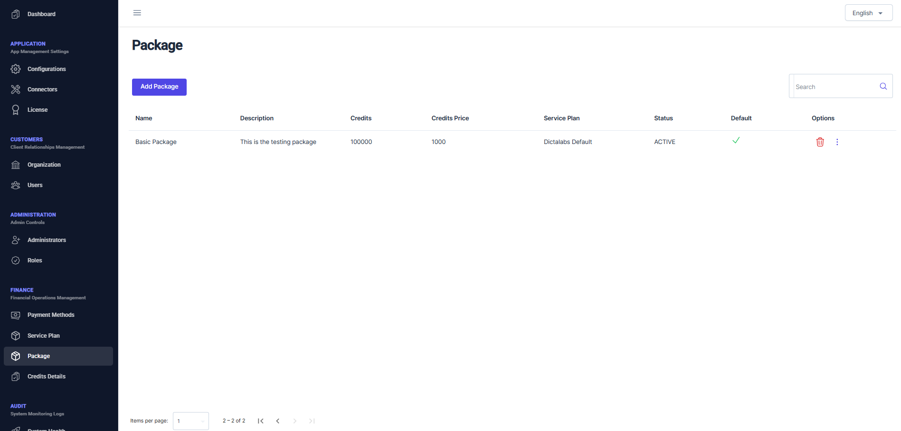
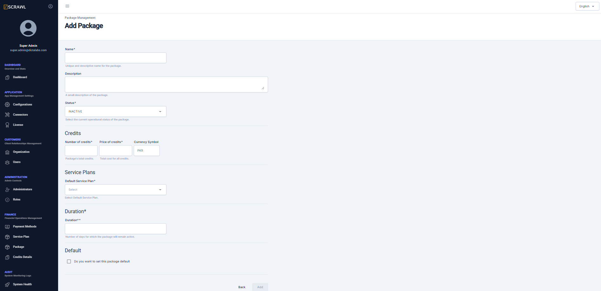

# Package  

Once the finance settings and service plans have been configured, the next step is to create packages. Packages define how many credits are allocated to a specific signing user or organization, and whether administrators may apply custom pricing for those credits. In a typical finance flow, an administrator assigns a package to a signing user or organization. Each package specifies the number of credits included and links to a corresponding service plan. The service plan determines which signature qualifiers are available. Finally, users or organizations are charged according to the pricing structure set in the finance settings.

From the left navigation pane, click on **Package** under **FINANCE** to open the Package page.  

From this page, administrators can view a list of existing packages.  The useful details include **Credits**, **Credits Price**, **Service Plan**, **Status**, and finally whether a particular package is marked as default or not.  Under the **Options**, an administrator can choose to delete an existing package or click on three dots to mark an existing package as default or update an existing package.

Clicking on Add Package shows the following page:

Provide the following details to create a new package:

- Name and optional description for the package.
- Status whether **ACTIVE** or **INACTIVE**.
- Number of credits to be assigned under this package and the associated service plan.  Total price for the assigned credits is automatically updated based on the price defined for each credit from APPLICATION - > Finance Settings screen.  It is still possible for an administrator to increase or decrease this price if he/she wants to charge a bit extra or offer a discount on purchase of this package.
- A Service plan that is assigned to this package
- The duration within which the purchased package will be considered as expired.
- Whether this new package will be marked as default.