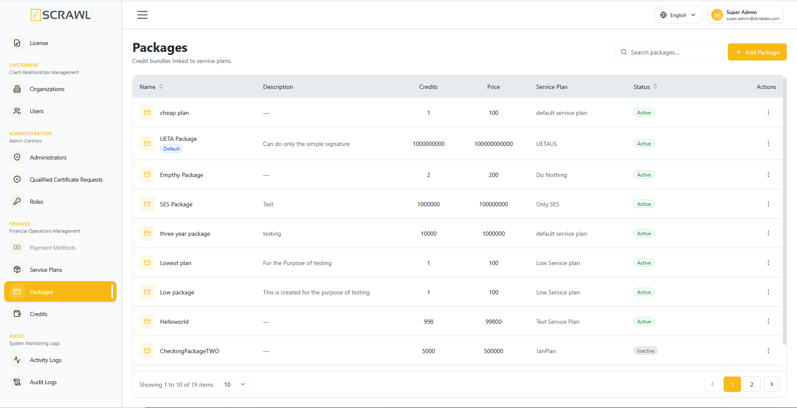
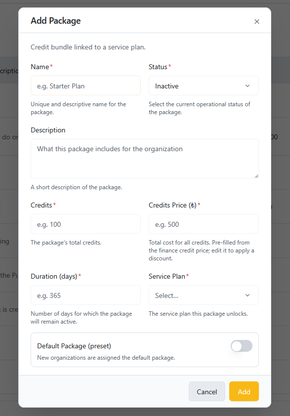

# Package  

Once the finance settings and service plans have been configured, the next step is to create packages. Packages define how many credits are allocated to a specific signing user or organization, and whether administrators may apply custom pricing for those credits. In a typical finance flow, an administrator assigns a package to a signing user or organization. Each package specifies the number of credits included and links to a corresponding service plan. The service plan determines which signature qualifiers are available. Finally, users or organizations are charged according to the pricing structure set in the finance settings.

From the left navigation pane, click on **Packages** under **FINANCE** to open the Packages page.  

From this page, administrators can view a list of existing packages.  The useful details include **Credits**, **Price**, **Service Plan**, **Status**, and finally whether a particular package is marked as default or not — the default package carries a **Default** badge under its name.  Click the three dots under **Actions** to choose **Make default** (not shown on the package that already is the default), **Edit package** to update an existing package, or **Delete package**.

A package cannot be deleted while it is the default package, or while it is assigned to one or more organizations.

Clicking on **Add Package** shows the following page:

Provide the following details to create a new package:

- **Name** and optional **Description** (up to 500 characters) for the package. The name must be 3–20 characters long, may contain only letters and single spaces, and must not match an existing package.
- **Status** whether **Active** or **Inactive**.
- Number of **Credits** to be assigned under this package (a whole number from 1 to 1,000,000).  The **Credits Price** — the total price for the assigned credits — is automatically filled in from the **Credit Price** defined on the **Configurations → Finance** tab.  It is still possible for an administrator to increase or decrease this price (a whole number from 0 to 1,000,000) if he/she wants to charge a bit extra or offer a discount on purchase of this package.
- A **Service Plan** that is assigned to this package. At least one service plan has to exist first.
- **Duration (days)** – the number of days (1 to 3,650) after which the purchased package will be considered as expired.
- **Default Package (preset)** – whether this new package will be marked as default. New organizations are assigned the default package. There is only ever one default: marking a package as default takes the mark off the previous one, and the default package cannot be set to **Inactive**.

> **Note:** If no currency and credit price have been saved under [Finance Settings](finance_settings.md) yet, the dialog says "Configure finance settings (currency & credit price) before creating packages." and a package cannot be created.