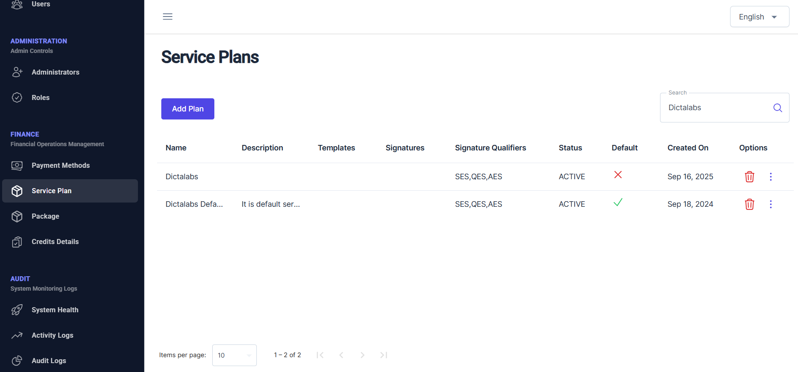
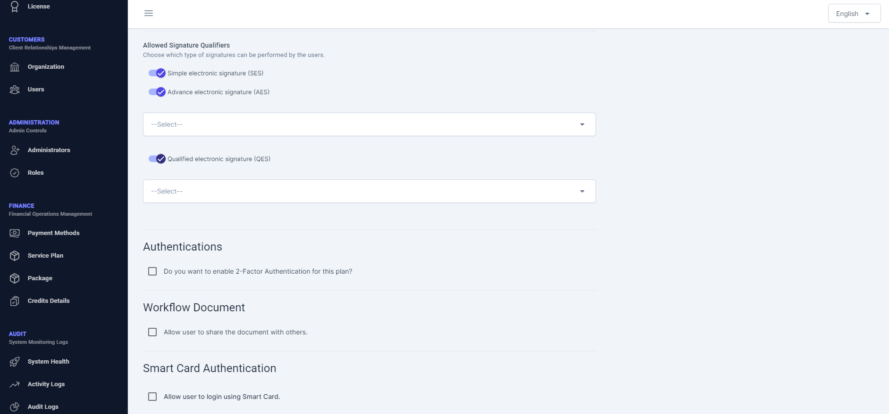

# Service Plan  

After configuring finance settings such as currency and pricing details, the next step is to create one or more service plans. A service plan defines which types of signature qualifiers are available to an organization or to a group of signing users assigned to that plan.

From the left navigation pane, click on **Service Plan** under **FINANCE** to open the Service Plan page.  

From this page, administrators can view a list of current service plans configured in this deployment of vScrawl.  These plans may be purchased by / assigned to particular organizations and/or signing users.  From this list an administrator can delete a service plan or click on 3 dots icon under **Options** and may choose to update an existing service plan.  A new service plan can always be added by clicking the **Add Plan** button on the top.

Clicking Add Plan button shows the following screen:

To add a new service plan, provide:

- A **Name** for the service plan, and optionally provide its description.
- Status whether **ACTIVE** or **INACTIVE**.
- Select the signature qualifiers i.e. **SES**, **AES** and/or **QES**.  In case any of **AES** and/or **QES** is selected in this service plan, it will be additionally required to select an option from the list of available signing connectors, for each of these.
- Administrator may additionally choose to turn on 2-Factor Authentication for users who use this service plan.
- Allows administrators to control whether users can share workflow documents with other users. When enabled, users can share documents for collaboration; when disabled, document sharing is restricted.
- Allows users to log in to the system using **SmartCard authentication**. When enabled, SmartCard login is available; when disabled, users must use the standard login methods.