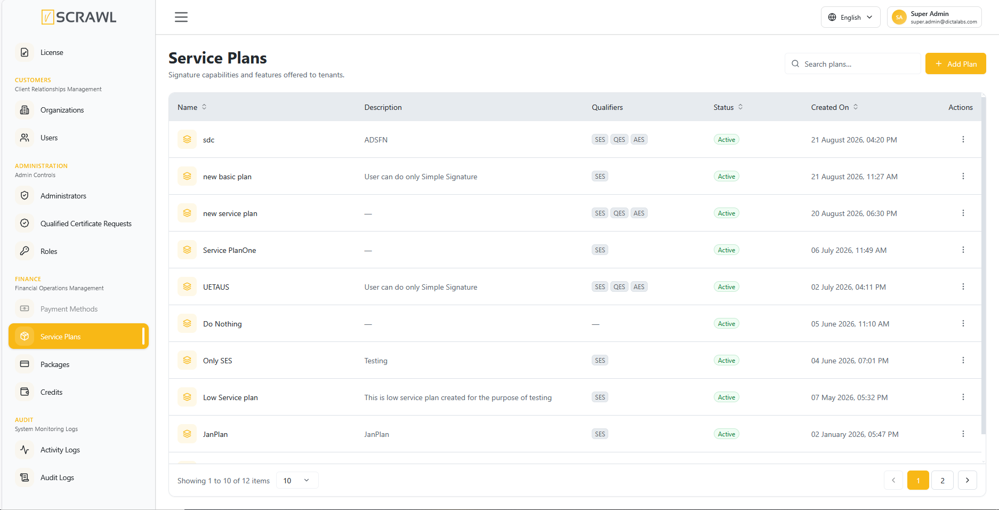
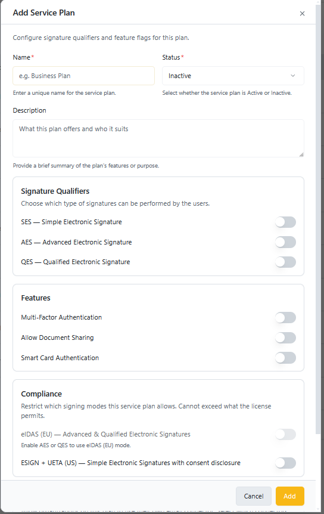
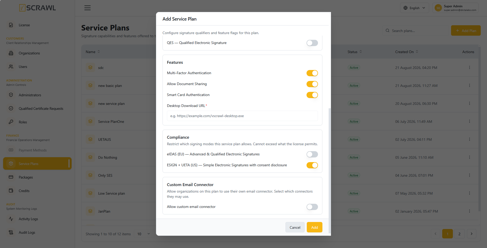

# Service Plan  

After configuring finance settings such as currency and pricing details, the next step is to create one or more service plans. A service plan defines which types of signature qualifiers are available to an organization or to a group of signing users assigned to that plan.

From the left navigation pane, click on **Service Plans** under **FINANCE** to open the Service Plans page.  

From this page, administrators can view a list of current service plans configured in this deployment of vScrawl, with each plan's **Name**, **Description**, **Qualifiers**, **Status** and **Created On** date. The default plan — the first plan created on an installation is marked as the default — carries a **Default** badge under its name.  These plans may be purchased by / assigned to particular organizations and/or signing users.  From this list an administrator can click the three-dots icon under **Actions** and choose **Edit plan** to update an existing service plan, or **Delete plan** to remove it.  A new service plan can always be added by clicking the **Add Plan** button on the top.

A plan cannot be deleted while it is the default plan ("Default Service Plan cannot be deleted.") or while a package still uses it.

Clicking Add Plan button shows the following screen:

To add a new service plan, provide:

- A **Name** for the service plan, and optionally provide its **Description** (up to 500 characters). The name is required, must be 3–20 characters long, may contain only letters and single spaces, and must not match an existing plan.
- **Status** whether **Active** or **Inactive**. A new plan starts as **Inactive**.
- Under **Signature Qualifiers**, select **SES**, **AES** and/or **QES**.  In case any of **AES** and/or **QES** is selected in this service plan, it will be additionally required to select at least one connector from the list of available signing connectors (**AES connectors** / **QES connectors**), for each of these. **AES** and **QES** are only offered when the license permits eIDAS.
- Under **Features**:
    - **Multi-Factor Authentication** – turn on multi-factor authentication for users who use this service plan.
    - **Allow Document Sharing** – controls whether users can share workflow documents with other users. When enabled, users can share documents for collaboration; when disabled, document sharing is restricted.
    - **Smart Card Authentication** – allows users to log in to the system using a smart card. When enabled, SmartCard login is available; when disabled, users must use the standard login methods. Turning it on also asks for a **Desktop Download URL** (required, a full `http://` or `https://` address).
- **Compliance** – Restrict which signing modes this service plan allows (cannot exceed what the uploaded license permits — see [License Manager](../other_admin_operations/license_manager.md)):
    - **eIDAS (EU) — Advanced & Qualified Electronic Signatures**
    - **ESIGN + UETA (US) — Simple Electronic Signatures with consent disclosure**
    - These toggles only appear when the corresponding mode is enabled on the license. If the license permits only one mode, that mode is switched on and cannot be turned off; if it permits both, at least one must be selected. When it permits both, the eIDAS toggle stays off and greyed out ("Enable AES or QES to use eIDAS (EU) mode.") until **AES** or **QES** is selected above.
- **Cloud Source** – Choose whether organizations on this plan may import documents from **Google Drive** or **Dropbox**, and which connector each provider uses. See [Cloud Source](#cloud-source) below.
- **Custom Email Connector** – Toggle **Allow custom email connector** to let organizations on this plan use their own email connector(s) instead of the system default, then select which connectors they may use from **Available email connectors** (at least one is required). See [Custom Email Connector](#custom-email-connector) below.

!!! note ""
    A plan can only offer what the platform allows. If **Enable Digital Signatures in the Application** is switched off under [Signature](../other_admin_operations/signature_settings.md#digital-signatures), AES and QES are unavailable to every user, whatever their plan says.

---

## Cloud Source

A signer can bring a document in from their own Google Drive or Dropbox instead of browsing their computer. Whether that is offered is decided **per service plan**, so it can be granted to some organizations and withheld from others on the same installation.

Two things are set for each provider, and both are required:

- **Import from Google Drive** / **Import from Dropbox** – whether the provider is offered at all.
- **Connector** – which [Cloud Source connector](../connectors/add_connectors.md#cloud-source-connectors) supplies the credentials. The plan cannot be saved with a provider switched on and no connector chosen.

The connector is named explicitly rather than picked automatically because more than one can exist. An installation may keep a separate Google project or Dropbox app per environment, per customer, or per brand, and "the newest active one" would be a guess at which of those an organization consented to.

Only **Active** connectors of that provider are listed. If a plan points at a connector that is no longer listed — typically one that has since been deactivated — the dropdown shows it as *Connector {id} — no longer available* so the stale choice is visible rather than silently kept.

### What a signer sees

- The provider appears on the upload screen only when the plan grants it **and** the named connector is still usable. Anything missing means the button is simply not shown — a signer has no use for the difference between "your plan does not include this" and "an administrator misconfigured it", and a half-configured provider would put a button on screen that cannot work.
- Switching a provider off removes it at the users' next sign-in. Documents already imported are unaffected: an imported file is an ordinary uploaded document from the moment it arrives.

### Swapping the connector

Because the plan records the connector's **id**, moving to a different connector is a change to every plan that offers the provider — not only to the connector list.

Add the new connector, select it on each plan, and **only then** deactivate the old one. Deactivating is not blocked: a plan that still names the old connector keeps its id, the dropdown shows it as *no longer available*, and the provider simply stops being offered to that plan's organizations, with no error shown to signers.

A connector that any service plan still names — even a plan on which that provider is currently switched off — cannot be deleted. The delete is refused with **Connector can't be deleted**, listing the **Service plans using this connector**; point those plans at another connector first.

> **Note:** The connector itself is added under [Connectors](../connectors/add_connectors.md#cloud-source-connectors), and the provider-side application it needs is described in [Set Up Cloud Source Providers](../connectors/cloud_source_setup.md).

---

## Custom Email Connector

By default every email the platform sends goes through the system's default email connector. **Allow custom email connector** lets the organizations on a plan send their emails through a different provider instead.

- **The license comes first.** When the uploaded license does not permit it, the toggle is shown greyed out with "Not permitted by the current license." and the plan cannot offer it.
- **Only Active email connectors** are listed under **Available email connectors**. If none exists the list reads "No active email connectors are available. Add one under Connectors first." The plan cannot be saved with the toggle on and no connector selected.
- **The organization makes the choice.** Once its plan allows it, an organization owner chooses in their own organization settings between one of the connectors you selected here and their own email provider settings.

Taking the permission away takes effect on save:

- Switching **Allow custom email connector** off — or the license no longer permitting it — returns **every** organization on the plan to the system default.
- Removing a connector from **Available email connectors** returns the organizations that had picked **that** connector to the system default. Organizations using their own provider settings are not affected.

!!! note ""
    An organization that sends through its own provider does not fall back to the system default when that provider fails: the message is retried on the same provider only. Password-reset and account-verification emails are sent by the sign-in service and never go through an organization's provider.

A connector that is offered by a plan, or that an organization has selected, cannot be deleted from [Connectors](../connectors/add_connectors.md).
