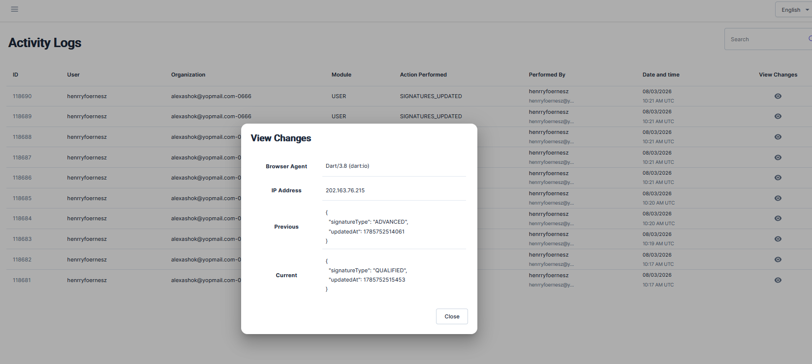
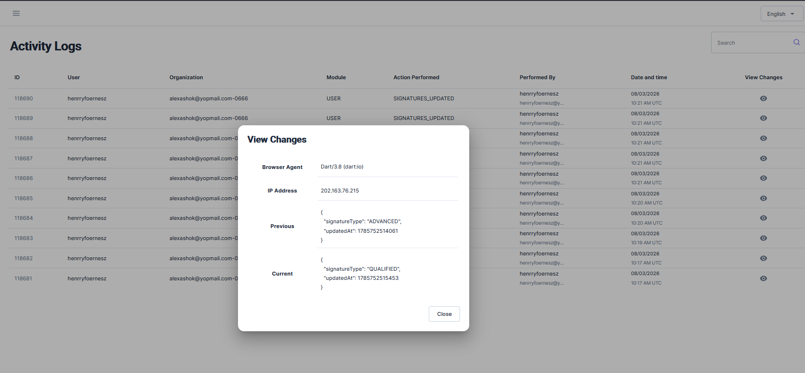

# Activity Logs

**Activity Logs** is a chronological audit trail of actions performed by end users (organization owners and their team members) across the platform — separate from admin-performed actions, which are tracked in [Audit Logs](audit_logs.md).

## Accessing Activity Logs

1. Log in to the admin console.
2. From the left navigation menu, under **Audit**, click **Activity Logs**.

Each row shows: **ID**, **User**, **Organization**, **Module**, **Action Performed**, **Performed By**, and **Date and time**. Use the search box to filter entries, and the pagination controls at the bottom to page through results.

## Viewing a Change

Click the **eye icon** in the **View Changes** column on any row to see exactly what changed:

- **Browser Agent** and **IP Address** the action was performed from.
- **Previous** – the record's state before the action.
- **Current** – the record's state after the action.

Click **Close** to return to the log list.
