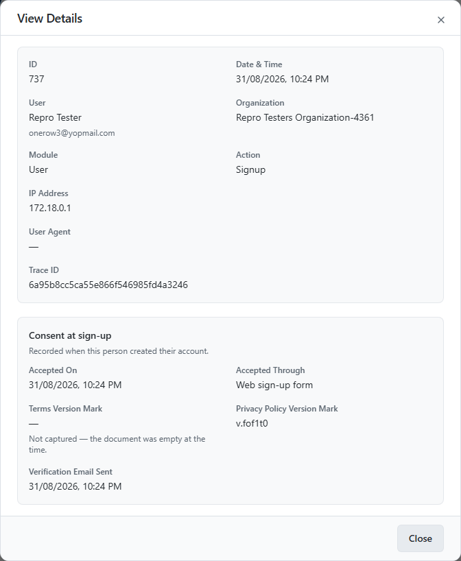

# Activity Logs

**Activity Logs** is a chronological audit trail of actions performed by end users (organization owners and their team members) across the platform — separate from admin-performed actions, which are tracked in [Audit Logs](audit_logs.md).

## Accessing Activity Logs

1. Log in to the admin console.
2. From the left navigation menu, under **Audit**, click **Activity Logs**.

Each row shows: **ID**, **User**, **Organization**, **Module**, **Action**, **Performed By**, and **Date and time**. Use the search box to filter entries, and the pagination controls at the bottom to page through results.

## Viewing a Change

Click the **eye icon** in the **View Changes** column on any row to see exactly what changed:

- **Browser Agent** and **IP Address** the action was performed from.
- **Previous** – the record's state before the action.
- **Current** – the record's state after the action.
- **Action** - what action was performed.
- **Module** - In which module the change was occured.
- **Trace ID** - The Id that can be used to trace the activity.
- **Date & Time** - Shows the date and time of the action.

### Consent at sign-up

Two row types carry an extra panel.

**Signup** is an account being created. Creating one used to leave two entries — the acceptance and the verification email — which a reader had to put back together; it is now one row, and the panel carries both. It shows when the person accepted the Terms and Privacy Policy, which screen collected it, the marks identifying the exact wording they were shown, and when their first verification email went out.

**Terms and Privacy Policy Accepted** is the same acceptance without a sign-up around it — an invited member finishing their setup, or somebody asked once after a social sign-in. See
[Consent Records](../compliance/consent_records.md#4-terms-acceptance-at-account-creation).

!!! note ""
    **Previous** and **Current** are not shown on these two rows. They record something that
    happened rather than something that changed, so there is no before and after — the panel is the
    whole record. Every other row type is unchanged.

    A **later** verification email — one the person asks for from the "check your email" screen —
    still gets its own **Email Verification Sent** row. Only the first, the one that belongs to the
    sign-up, is folded in.

Click **Close** to return to the log list.
