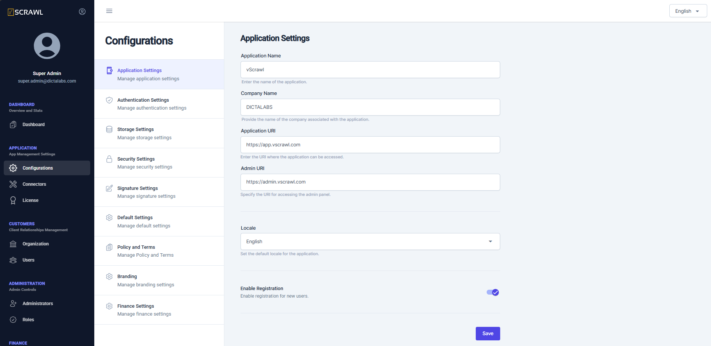

# Application Settings  

The **Application Settings** screen allows administrators to configure various aspects of the deployed application, including:  

- Assigning a **Company Name**.  
- Configuring the **Application URI**.  
- Setting the **Admin URI** for the admin interface.  
- Selecting a default **Locale** for the current deployment.
- Enabling registration of new users through Sign Up.
