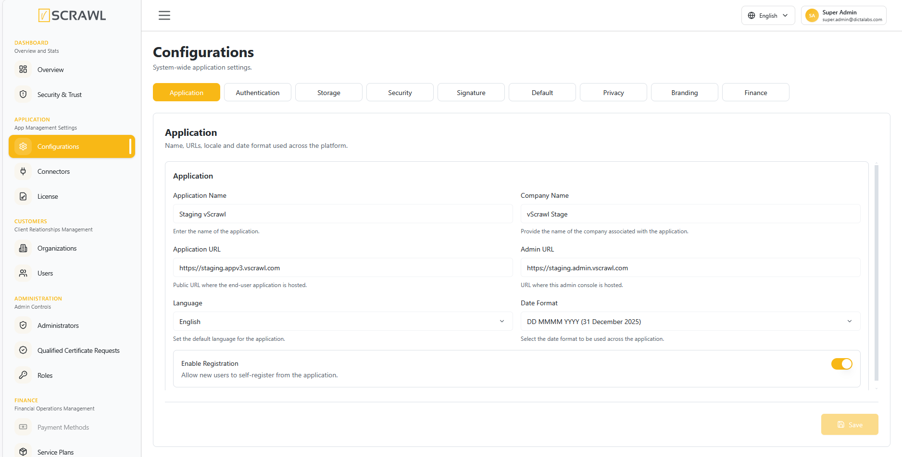

# Application   

The **Application** screen allows administrators to configure various aspects of the deployed application, including:  

- Assigning a **Company Name**.  
- Configuring the **Application URI**.  
- Setting the **Admin URI** for the admin interface.  
- Selecting the default **Language** for the application. This sets the language the application starts in for every user; each user can still switch to another language from the language selector.
- Enabling registration of new users through Sign Up.
- Configuring the **Global Date Format** to define how dates are displayed across the application (e.g., `MM/DD/YYYY`, `DD/MM/YYYY`, `YYYY-MM-DD`, etc.).

## Account deletion

At the foot of the screen sits **Erase personal data on deletion**, which decides how much is actually removed when somebody deletes their own account — or when you delete it for them.

| | **On** (ships this way) | **Off** |
| --- | --- | --- |
| What happens | The account closes and its data goes with it: documents, the organization and everything in it, saved signatures, certificates and identity-verification records. The account row is anonymised | The account closes and **nothing else is touched**. Every one of those things stays exactly where it was |
| Signing up again with the same address | Starts a new, empty account | Returns the person to the account they closed, with everything still attached |
| An erasure request | The product fulfils it | Has to be carried out by hand, in the database |

Activity and audit entries keep the name and address under **either** setting. They are the record of what happened, and an entry nobody can be attributed to is not a record.

!!! warning ""
    **With it off, the email address is a key to that account.** Whoever registers it next lands inside it, looking at the previous holder's documents. That is what you want for somebody returning to their own account, and it is a disclosure risk for an address that could pass to a different person — a shared or company mailbox being the obvious case.

    Leave it on unless you have a specific reason not to. Off also means storage is never reclaimed.

!!! note ""
    **This switch also governs automatic closures.** An account closed by the inactive-account
    retention job runs the same deletion path, so whatever this setting does to a deletion somebody
    asked for, it does to one the schedule performs — see
    [Data Retention → Inactive accounts](../compliance/data_retention.md#inactive-accounts).

    Unlike the retention windows, this value is read **once when the service starts**. Change it and
    the scheduled job keeps using the old setting until admin-service is restarted.
