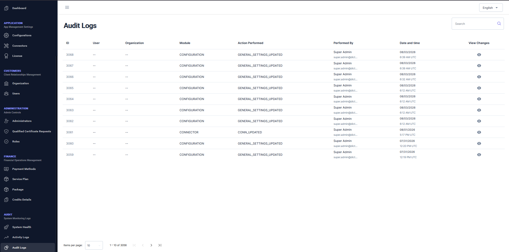
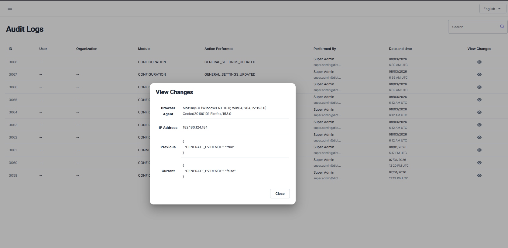

# Audit Logs

**Audit Logs** is a chronological trail of actions performed by **administrators** in the admin console — the counterpart to [Activity Logs](activity_logs.md), which tracks end-user actions instead.

## Accessing Audit Logs

1. Log in to the admin console.
2. From the left navigation menu, under **Audit**, click **Audit Logs**.

Each row shows: **ID**, **User**, **Organization**, **Module**, **Action Performed**, **Performed By** (admin name and email), and **Date and time**. Use the search box to filter entries, and the pagination controls at the bottom to page through results.

## Viewing a Change

Click the **eye icon** in the **View Changes** column on any row to see exactly what changed:

- **Browser Agent** and **IP Address** the action was performed from.
- **Previous** – the setting's state before the action.
- **Current** – the setting's state after the action.

Click **Close** to return to the log list.
