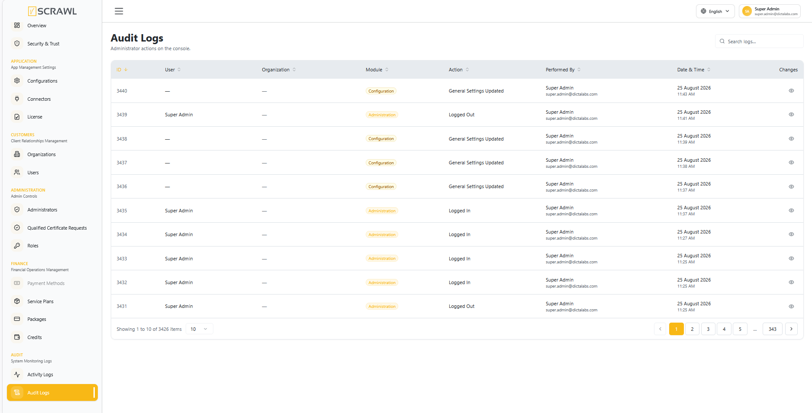
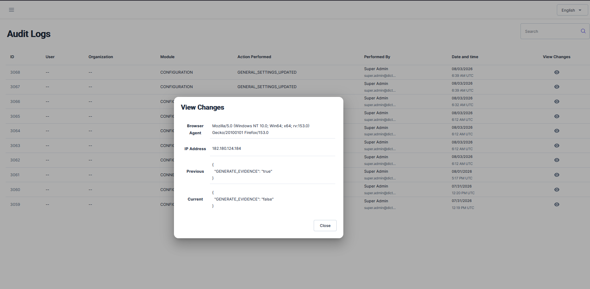

# Audit Logs

**Audit Logs** is a chronological trail of actions performed by **administrators** in the admin console — the counterpart to [Activity Logs](activity_logs.md), which tracks end-user actions instead.

## Accessing Audit Logs

1. Log in to the admin console.
2. From the left navigation menu, under **Audit**, click **Audit Logs**.

Each row shows: **ID**, **Module**, **Action**, **Performed By** (admin name and email), and **Date & Time**. Most administrator actions — configuration, connectors, packages — belong to no single organization, so the list has no organization column; where an entry does name one, it is shown in the details. Use the search box to filter entries — it matches the administrator's or the affected user's name or email, the organization, the module, the action, the IP address and the browser user agent — and the pagination controls at the bottom to page through results.

## Viewing a Change

Click the **eye icon** in the **Changes** column on any row to open **View Details** and see exactly what changed:

- **ID** and **Date & Time** of the entry.
- **User** – the user the action was taken on, if any, with their email address.
- **Performed By** – the administrator who performed the action.
- **Organization**, **Module** and **Action** – where the change occurred and what action was performed.
- **IP Address** and **User Agent** the action was performed from.
- **Trace ID** - The Id that can be used to trace the activity.
- **Previous** – the setting's state before the action.
- **Current** – the setting's state after the action.
- **Activity** – for entries that record something being created or deleted rather than changed, the stored record itself.

Entries written by the platform itself rather than by an administrator — for example the nightly summary of the [data retention](../compliance/data_retention.md) job — are recorded here too.

Click **Close** to return to the log list.
