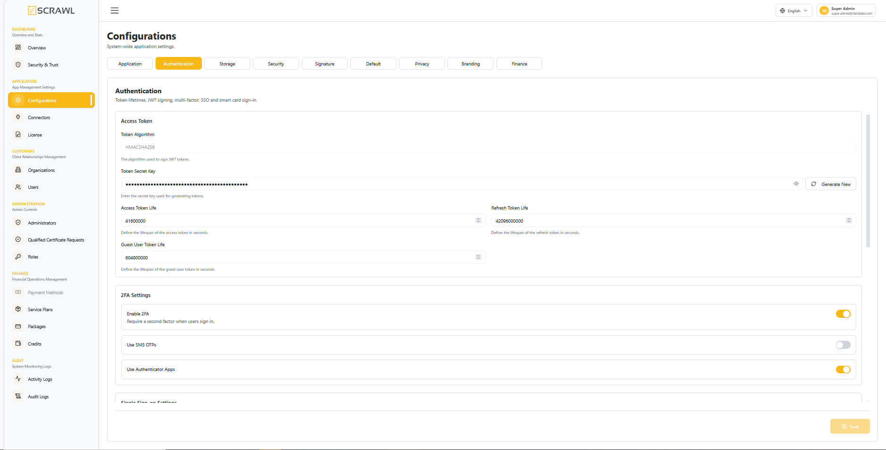

# Authentication Settings  

The **Authentication Settings** screen is used to configure various settings to ensure secure collaboration on sensitive document workflows.  

The screen is divided into the following sections.

## Access Token  
vScrawl provides REST-based APIs for all its operations and uses **access tokens** and **refresh tokens** for secure authentication. In this section the administrator can:  
- Define a secure algorithm for token generation, such as `HMACSHA256`, in **Token Algorithm**.  
- Review the **Token Secret Key** used to sign the tokens. The field is read-only — use the **Generate New** button at the bottom of the section to issue a fresh secret.  
- Configure the **life span** of access and refresh tokens.  
- Configure the **Guest User Token Life**, as guest users may be invited to sign documents.  
- Specify these lifespans in **milliseconds**.  

> **Note:** Generating a new Token Secret Key invalidates the tokens already issued, so signed-in users will have to log in again.

## 2FA Settings  
For secure user login to the vScrawl application, **Two-Factor Authentication (2FA)** can be enabled with the **Enable 2FA** toggle. Turning it on reveals the methods that users are allowed to choose from:  
- **Use SMS OTPs** – a one-time password is sent to the user by SMS.  
- **Use Authenticator Apps** – the user verifies through an authenticator app.  

Once 2FA is enabled, users configure it from their own user profile. Turning **Enable 2FA** off hides and disables both methods.

## Single Sign-on Settings  
Single sign-on is controlled by a parent **Enable Single Sign-on** toggle. Turning it on reveals two provider toggles nested underneath it:

- **Use Google Authentication** – Lets users log in with their **Google account**.
- **Use KeyCloak Authentication** – Lets users log in via **Keycloak**. This requires a [Keycloak connector](../connectors/add_connectors.md#auth-connectors) to be configured first.

Turning the parent **Enable Single Sign-on** toggle off disables both providers, regardless of their individual state; when off, only the standard login methods are available.

## Smart Card Authentication
Turn on **Enable authentication using smart cards** to allow users to log in with a **Smart Card**.

## User Onboarding
These settings control how users are enrolled into the **Remote Signature Service**, and are only shown when the installed license includes advanced or qualified electronic signatures.

- **Onboard Users for Remote Signature Service** – Starts the onboarding process for remote signing. When it is on, two more fields appear:
    - **Google Playstore Link** – Link to the signing app on Google Play, shown to users during onboarding.
    - **Apple App Link** – Link to the same app on the Apple App Store.
- **Admin Approval is Required for Onboarding** – When on, an administrator must approve each onboarding request before it completes. Requests waiting for approval are listed under [Qualified Certificate Requests](qualified_cert_requests.md).

## Link Expiry
The expiry times for email links and for invite / password reset links are configured in the [Link Expiry](security_settings.md#link-expiry) section of the Security Settings page.
