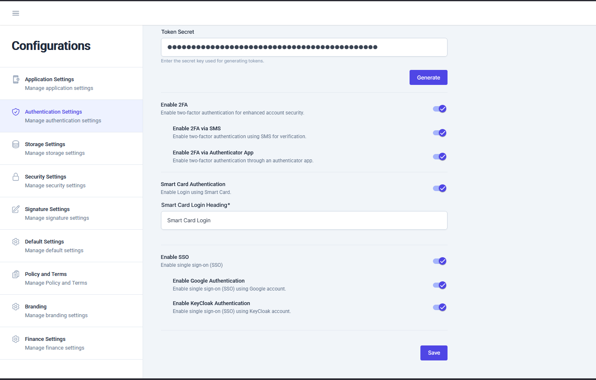

# Authentication Settings  

The **Authentication Settings** screen is used to configure various settings to ensure secure collaboration on sensitive document workflows.  

## Token Configuration  
vScrawl provides REST-based APIs for all its operations and uses **access tokens** and **refresh tokens** for secure authentication. Using this screen, the administrator can:  
- Configure the **life span** of access and refresh tokens.  
- Configure the **guest user's access token life span**, as guest users may be invited to sign documents.  
- Configure the **Expiration Time for Email Links** and **Invite & Password Reset Link Expiry**
- Specify these lifespans in **milliseconds**.  
- Define a secure algorithm for token generation, such as `HMACSHA256`.  

## Two-Factor Authentication (2FA)  
For secure user login to the vScrawl application, **Two-Factor Authentication (2FA)** can be enabled. Once enabled:  
- Users can configure 2FA from their respective user profiles.  
- Administrators can specify 2FA methods, including:  
  - **SMS-based authentication**.  
  - **Google Authenticator app**.  

## Smart Card Authentication
Administrators can enable or disable **Smart Card Authentication** to allow login through a **Smart Card**. When enabled, a required **Smart Card Login Heading** field appears — the text shown as the heading on the smart card login screen.

## Single Sign-On (SSO)  
SSO is controlled by a parent **Enable SSO** toggle. Turning it on reveals two provider toggles nested underneath it:

- **Enable Google Authentication** – Lets users log in with their **Google account**.
- **Enable KeyCloak Authentication** – Lets users log in via **Keycloak**. This requires a [Keycloak connector](../connectors/add_connectors.md#auth-connectors) to be configured first.

Turning the parent **Enable SSO** toggle off disables both providers, regardless of their individual state; when off, only the standard login methods are available.

