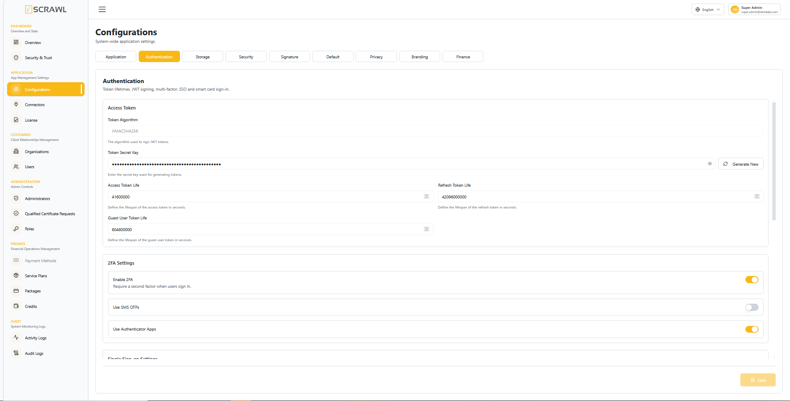

# Authentication  

The **Authentication Settings** screen — the **Authentication** tab of **Configurations** — is used to configure various settings to ensure secure collaboration on sensitive document workflows.  

The screen is divided into the following sections.

## Access Token  
vScrawl provides REST-based APIs for all its operations and uses **access tokens** and **refresh tokens** for secure authentication. In this section the administrator can:  

- Review the algorithm used to sign the tokens in **Token Algorithm**. The field is read-only and set automatically.  
- Review the **Token Secret Key** used to sign the tokens. The field is read-only — use the **Generate New** button beside it to issue a fresh secret.  
- Configure the life span of access and refresh tokens in **Access Token Life** and **Refresh Token Life**.  
- Configure the **Guest User Token Life**, as guest users may be invited to sign documents.  
- Specify these lifespans in **seconds**, as a whole number between **60** and **31536000** (one year). A value outside that range is marked and the settings are not saved.  

> **Note:** **Generate New** only fills in the field; the new key takes effect when you click **Save**. From then on, tokens that were signed with the previous key are no longer accepted, so anyone holding one will have to log in again.

## 2FA Settings  
For secure user login to the vScrawl application, **Two-Factor Authentication (2FA)** can be enabled with the **Enable 2FA** toggle. Turning it on reveals the methods that users are allowed to choose from:  

- **Use SMS OTPs** – a one-time password is sent to the user by SMS.  
- **Use Authenticator Apps** – the user verifies through an authenticator app.  

Once 2FA is enabled, users configure it from their own user profile. Turning **Enable 2FA** off hides and disables both methods.

## Single Sign-on Settings  
Single sign-on is controlled by a parent **Enable Single Sign-on** toggle. Turning it on reveals two provider toggles nested underneath it:

- **Use Google Authentication** – Lets users log in with their **Google account**.
- **Use KeyCloak Authentication** – Stored with the other single sign-on settings, but it currently has no visible effect: the sign-in page shows no separate Keycloak option for it.

Turning the parent **Enable Single Sign-on** toggle off disables both providers, regardless of their individual state; when off, only the standard login methods are available.

## Smart Card Authentication
Turn on **Enable authentication using smart cards** to allow users to log in with a **Smart Card**. Turning it on also asks for a **Smart Card Login Heading** — the heading shown on the smart card login screen, required, 3–50 characters.

## User Onboarding
These settings control how users are enrolled into the **Remote Signature Service**, and are only shown when the installed license enables **eIDAS** mode (see [License Manager](license_manager.md)). Without it they are saved as off.

- **Onboard Users for Remote Signature Service** – Starts the onboarding process for remote (AES/QES) signing. When it is on, three more settings appear:
    - **Google Play Link** – Link to the signing app on Google Play, shown to users during onboarding.
    - **Apple App Link** – Link to the same app on the Apple App Store.
    - **Admin Approval is Required for Onboarding** – When on, an administrator must approve each onboarding request before it completes. Requests waiting for approval are listed under [Qualified Certificate Requests](qualified_cert_requests.md).

    Both store links are optional, but when filled in they must be full `http://` or `https://` addresses.

When **Onboard Users for Remote Signature Service** is off, users are not registered on the Remote Signature Service: the signing-app download links and the qualified certificate request are not offered to them, and QES is only available to plans that also use a QES connector that does not depend on the Remote Signature Service. AES signing with a key the platform issues itself is not affected. Saving with it off also clears the two store links and switches **Admin Approval is Required for Onboarding** off.

