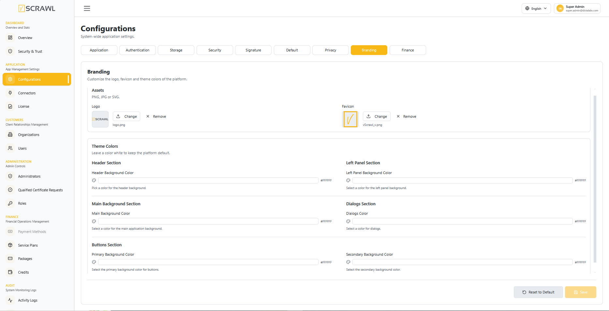

# Branding  

vScrawl is a brandable application. In addition to the option to change the language in the **Application Settings**, it is also possible to change the visual appearance from the **Branding** tab of **Configurations**.  

Under **Assets** you can update the **Logo** and **Favicon** with your own company's images (PNG, JPG or SVG). Additionally, under **Theme Colors** the color scheme can be customized for the following sections:

- Header Section – **Header Background Color**
- Left Panel Section – **Left Panel Background Color**
- Main Background Section – **Main Background Color**
- Dialogs Section – **Dialogs Color**
- Buttons Section – **Primary Background Color** and **Secondary Background Color**

Leave a color white to keep the platform default.

## Live preview

Every change is previewed on the admin console straight away — pick a color or a new logo and the sidebar, header, buttons and dialogs around you take it on — but nothing is stored until you click **Save**. If you leave the tab without saving (after confirming that the changes may be discarded), the saved branding comes back.

- **Remove** beside the logo or favicon asks for confirmation first; the image is cleared when you save.
- **Reset to Default** restores the default logo, favicon and colors after a confirmation. This cannot be undone.
 