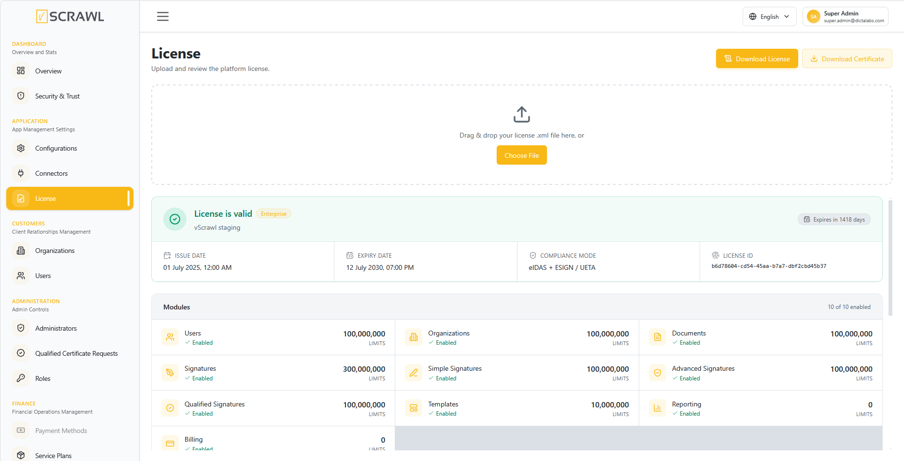
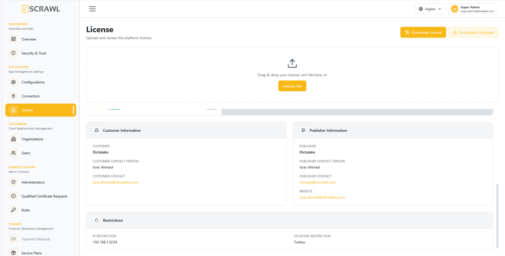
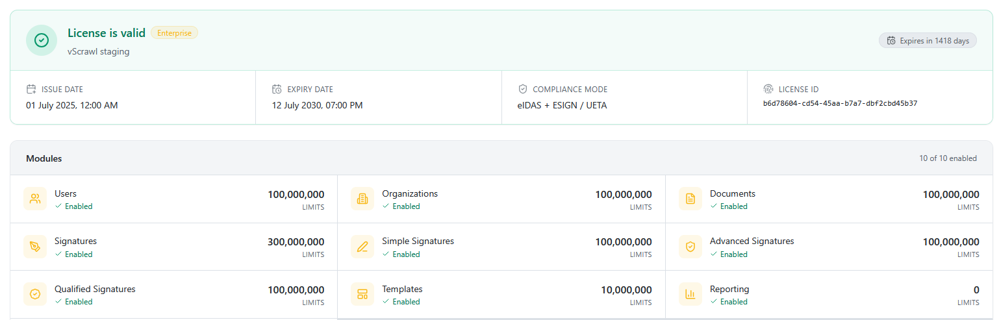

# License Manager  

From the left navigation pane, click on **License** under **APPLICATION** to open the License Manager.  

From this page, administrators can:  
- View details relevant to the configured vScrawl license file, including:  
  - License type  
  - **Compliance Mode** – shows which signing regulation regimes this license permits: **eIDAS (EU)**, **ESIGN / UETA (US)**, or **eIDAS + ESIGN / UETA** if both are enabled.
  - Product name  
  - License period  
  - Customer information (to whom the license file was issued)  
- Review limits applied by the license file on various licensed modules.  

!!! note ""
    Compliance Mode drives which features appear elsewhere in the app. **eIDAS** mode is required for the [Qualified Certificate Requests](qualified_cert_requests.md) screen and eIDAS Compliance Mode toggles on a [Service Plan](../finance_settings/service_plans.md) to be available.
- Download the license file signing certificate and the license file itself for verifying the signature on the license file.  
- Configure a new license file if:  
  - The current license is about to expire.  
  - A new license is required to enable additional application modules.  

A new license file can be requested by contacting the respective sales representative or by writing to [info@dictalabs.com](mailto:info@dictalabs.com).   
