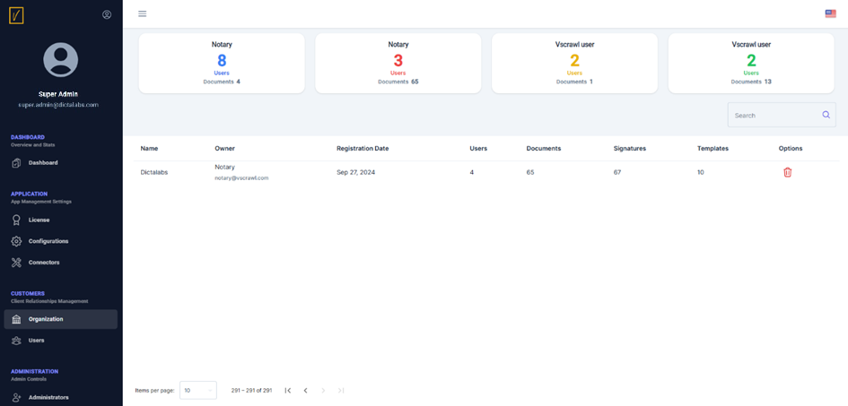

# Organization  

All vScrawl users who sign up for a vScrawl account own an organization, which they can use to create organization-wide document workflow templates (as part of preparing documents for sharing and signing).  

An organization owner can also invite other members to register under the same umbrella organization. Invited users will not follow the standard sign-up procedure; instead, they will simply follow the invitation to join an existing organization on vScrawl.  

Organizations are listed and can be managed from the following screen. This section mainly allows viewing organization details such as the number of users and documents. While not much can be done here, it is possible to delete a particular organization.

