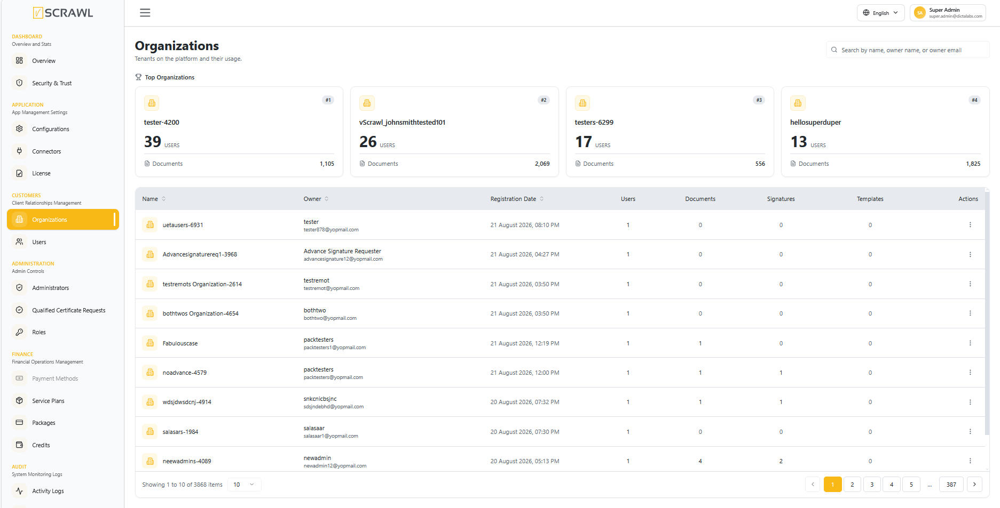

# Organization  

All vScrawl users who sign up for a vScrawl account own an organization, which they can use to create organization-wide document workflow templates (as part of preparing documents for sharing and signing).  

An organization owner can also invite other members to register under the same umbrella organization. Invited users will not follow the standard sign-up procedure; instead, they will simply follow the invitation to join an existing organization on vScrawl.  

Organizations are listed and can be managed from the **Organizations** screen, under **CUSTOMERS** in the left navigation pane. This section mainly allows viewing organization details such as the owner, the registration date and the number of users, documents, signatures and templates. While not much can be done here, it is possible to delete a particular organization — but only once it has no users other than its owner ("Cannot delete an organization that still has users.").

Also the Administrators can renew or update the package of an organization by clicking on the three dots in the **Actions** column:

- **Renew package** – adds the package's credits to the organization again and restarts its validity period from today, to ensure uninterrupted access to services. Credits left over from a package that has not yet expired are kept; an inactive package cannot be renewed.
- **Update package** – assigns the organization a different package.

## Organization email

An organization owner can send the organization's emails through its own email provider instead of the platform's default one, but only when the license permits it **and** the organization's service plan allows a custom email connector. See [Custom Email Connector](../finance_settings/service_plans.md#custom-email-connector).
