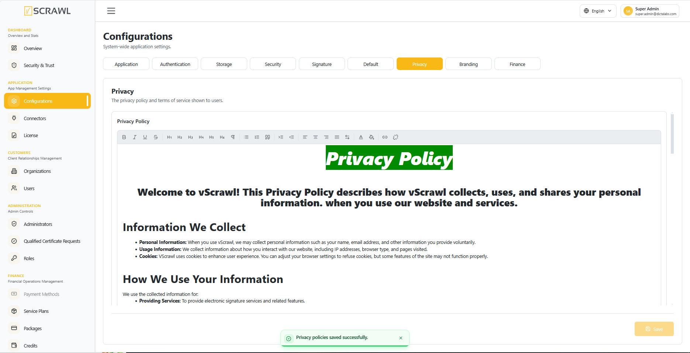

# Privacy Policy  

From the drop-down menu for policy, select either **Privacy Policy** or **Terms of Services**. You can then modify the selected policy using the editor available on the screen below.

Click **Save** to publish. The saved content appears immediately at `/privacy-policy` and `/terms-of-services` on the user-facing application, and is what the registration page links to.

!!! warning ""
    **Both policies ship empty.** Until you paste your content, users visiting the policy page see "Privacy policy content is not available right now."

    A published privacy policy is not optional — GDPR Articles 13 and 14 require you to tell people what you collect, why, how long you keep it, who you share it with, and what rights they have. See [GDPR Overview](../compliance/gdpr_overview.md).

## Keeping track of versions

When you change a policy, record **what changed and when**, outside this screen. The editor stores only the current text — it keeps no history, so a previous version cannot be recovered from here.

This matters because you may later need to show which version a particular user accepted. Keep dated copies of each published version alongside your other compliance records.

!!! note ""
    Put the effective date at the top of the policy text itself. It is the only part of the version history that users can see, and the only part that travels with the document if someone saves or prints it.

## What the editor will not publish

The editor accepts formatting — headings, lists, tables, links, images, colour —
and refuses anything that could **run** in a reader's browser. Scripts, embedded
frames and event handlers are stripped when the policy is saved, when it is loaded
back into this screen, and again when a visitor's browser renders it.

You do not need to do anything to enable this, and there is no way to switch it
off. If you paste content from a page that carried scripts, the text and its
formatting survive and the scripts silently do not.

!!! note ""
    Link buttons accept `http`, `https`, `mailto` and `tel` addresses only. A link
    of any other kind is dropped rather than published.

## Before you publish

- Replace every placeholder. A policy containing unfilled fields is worse than none — it is a documented failure to inform.
- Check that the retention periods you state match what you actually do. See [Data Retention](../compliance/data_retention.md).
- List the third-party providers you have configured — your email connector, and your storage connector if it is not local.
- Have it reviewed by someone qualified. This screen publishes a legal document.

