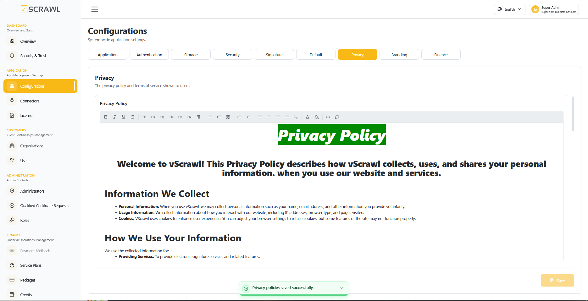

# Privacy Policy  

Open the **Privacy** tab of **Configurations**. From the **Policy** drop-down menu, select either **Privacy Policy** or **Terms of Service**. You can then modify the selected policy using the editor available on the screen below.

Click **Save** to publish. The saved content appears immediately at `/privacy-policy` and `/terms-of-services` on the user-facing application, and is what the registration page links to. A policy cannot be saved empty — the editor asks you to add some text first.

!!! warning ""
    **Both policies ship empty.** Until you paste your content, users visiting the policy page see "Privacy policy content is not available right now." (or the same message for the terms of service), and this tab shows a warning above the editor.

    A published privacy policy is not optional — GDPR Articles 13 and 14 require you to tell people what you collect, why, how long you keep it, who you share it with, and what rights they have. See [GDPR Overview](../compliance/gdpr_overview.md).

## Keeping track of versions

When you change a policy, record **what changed and when**, outside this screen. The editor stores only the current text — it keeps no history, so a previous version cannot be recovered from here.

This matters because you may later need to show which version a particular user accepted. Keep dated copies of each published version alongside your other compliance records.

!!! note ""
    Put the effective date at the top of the policy text itself. It is the only part of the version history that users can see, and the only part that travels with the document if someone saves or prints it.

## What the editor will not publish

The editor accepts formatting — headings, lists, tables, links, images, colour —
and keeps anything that could **run** away from readers. Scripts, embedded
frames and event handlers are stripped when the policy is loaded back into this
screen, and again when a visitor's browser renders it on the user-facing
application.

You do not need to do anything to enable this, and there is no way to switch it
off. If you paste content from a page that carried scripts, readers see the text
and its formatting and the scripts never run.

!!! note ""
    The link button accepts `http`, `https` and `mailto` addresses only; an address
    typed without a scheme is treated as `https`. Anything else is refused with
    "Enter a web address starting with http:// or https://, or an email link."

## Before you publish

- Replace every placeholder. A policy containing unfilled fields is worse than none — it is a documented failure to inform.
- Check that the retention periods you state match what you actually do. See [Data Retention](../compliance/data_retention.md).
- List the third-party providers you have configured — your email connector(s), and any Google Drive or Dropbox storage connector that still holds documents (new documents can only be written to Server Storage, but content already stored elsewhere stays there).
- Have it reviewed by someone qualified. This screen publishes a legal document.

