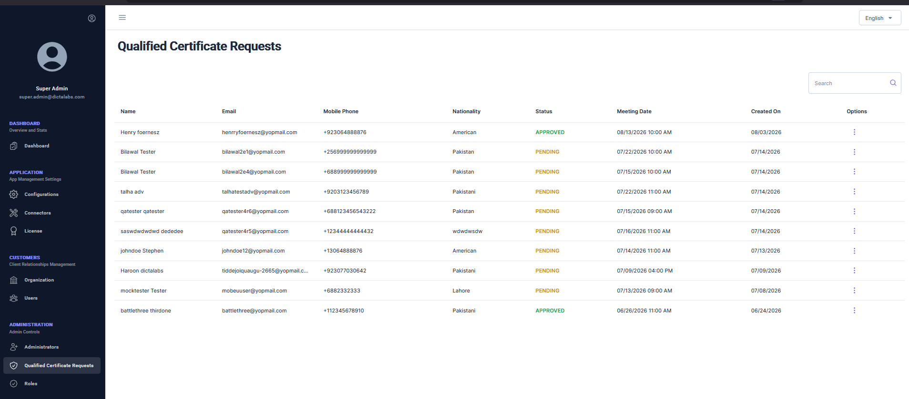
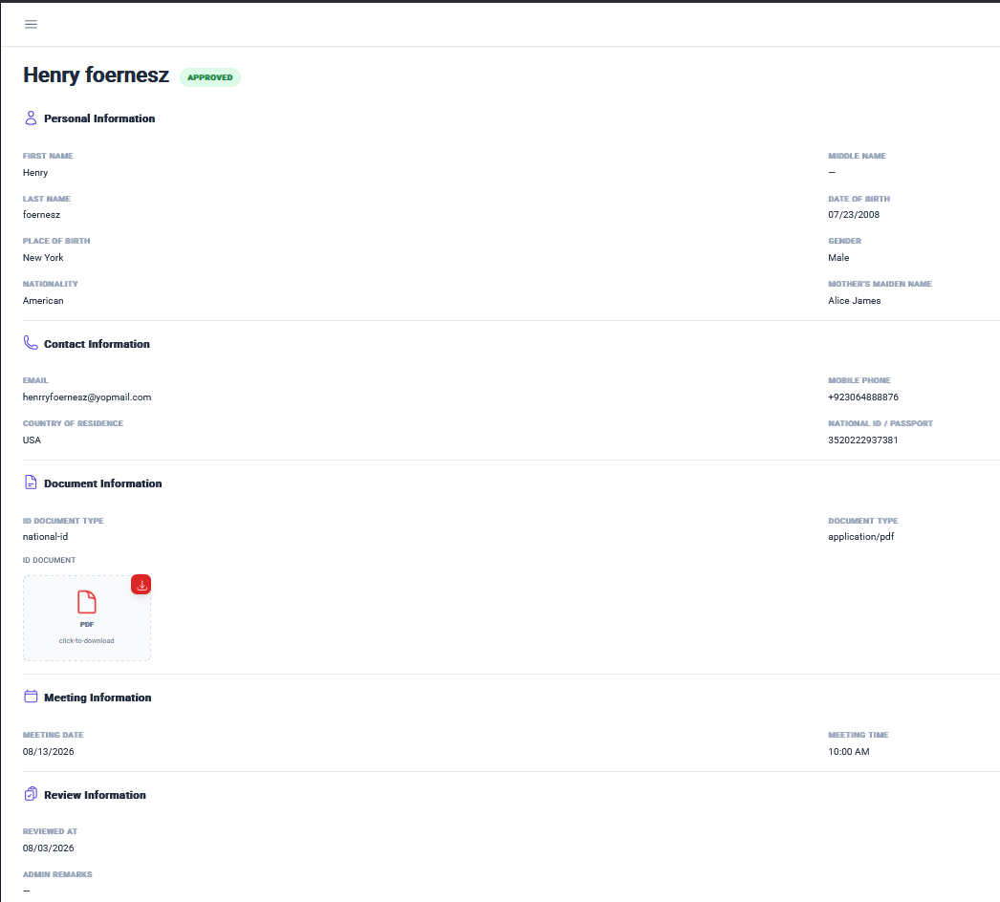

# Qualified Certificate Requests

The **Qualified Certificate Requests** screen lets administrators review the identity-verification (KYC) submissions users make when requesting a **Qualified Electronic Signature (QES)** certificate under eIDAS.

!!! note ""
    This screen only appears in the left-side navigation when the uploaded license enables **eIDAS mode**. See [License Manager](license_manager.md) for how the license determines this.

## Accessing Qualified Certificate Requests

1. Log in to the admin console.
2. From the left navigation menu, under **Administration**, click **Qualified Certificate Requests**.

The list shows every request with **Name**, **Email**, **Mobile Phone**, **Nationality**, **Status** (Pending / Approved / Rejected), **Meeting Date**, and **Created On**. Use the search box to filter by name or email.

## Reviewing a Request

Click a request row (or use the **⋮** Options menu) to open its details:

- **Personal Information** – First/Middle/Last Name, Date of Birth, Place of Birth, Gender, Nationality, Mother's Maiden Name.
- **Contact Information** – Email, Mobile Phone, Country of Residence, National ID / Passport number.
- **Document Information** – The submitted ID document, downloadable from the details page.
- **Meeting Information** – Scheduled Meeting Date and Time.
- **Review Information** – Reviewed At timestamp and any Admin Remarks left when the request was resolved.

## Approving or Rejecting

From a pending request, use the row's **⋮** Options menu (or the details page) to:

- **Approve** – Grants the user's QES certificate request.
- **Reject** – Opens a remarks dialog; enter a reason before confirming the rejection. The reason is saved as the request's **Admin Remarks**.
