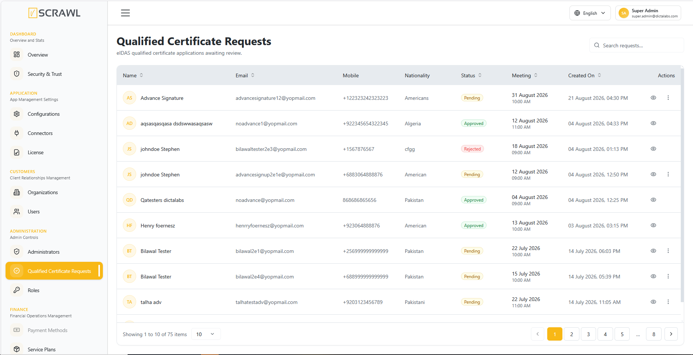
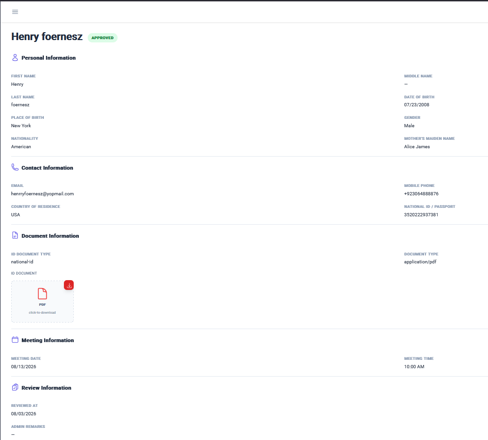

# Qualified Certificate Requests

The **Qualified Certificate Requests** screen lets administrators review the identity-verification (KYC) submissions users make when requesting a **Qualified Electronic Signature (QES)** certificate under eIDAS.

!!! note ""
    This screen only appears in the left-side navigation when the uploaded license enables **eIDAS mode**. See [License Manager](license_manager.md) for how the license determines this.

## Accessing Qualified Certificate Requests

1. Log in to the admin console.
2. From the left navigation menu, under **Administration**, click **Qualified Certificate Requests**.

The list shows every request with **Name**, **Email**, **Mobile**, **Nationality**, **Status** (Pending / Approved / Rejected), **Meeting**, **Created On** and **Actions**. Use the search box to filter by name or email.

## Reviewing a Request

Click the **eye icon** (**View details**) in the **Actions** column to open the request's details:

- **Personal Information** – First/Middle/Last Name, Date of Birth, Place of Birth, Gender, Nationality, Mother's Maiden Name.
- **Contact Information** – Email, Mobile, Country of Residence, National ID / Passport.
- **Document Information** – ID Document Type, Document MIME Type and the submitted **ID Document**, which can be downloaded from the dialog.
- **Meeting Information** – Scheduled Meeting Date and Time.
- **Review Information** – Reviewed At timestamp and any Admin Remarks left when the request was resolved.

## Approving or Rejecting

Only a **Pending** request can be approved or rejected. Use the row's **⋮** menu (or the buttons in the details dialog) to:

- **Approve** – Grants the user's QES certificate request.
- **Reject** – Opens the **Reject Certificate Request** dialog; enter a reason in **Remarks** (required — the applicant may see it) before confirming the rejection. The reason is saved as the request's **Admin Remarks**.

Each decision is recorded in [Audit Logs](audit_logs.md) as **Certificate Request Approved** or **Certificate Request Rejected**. Approving or rejecting does not delete the submitted identity document — see [Data Retention → Identity documents](../compliance/data_retention.md#identity-documents).
