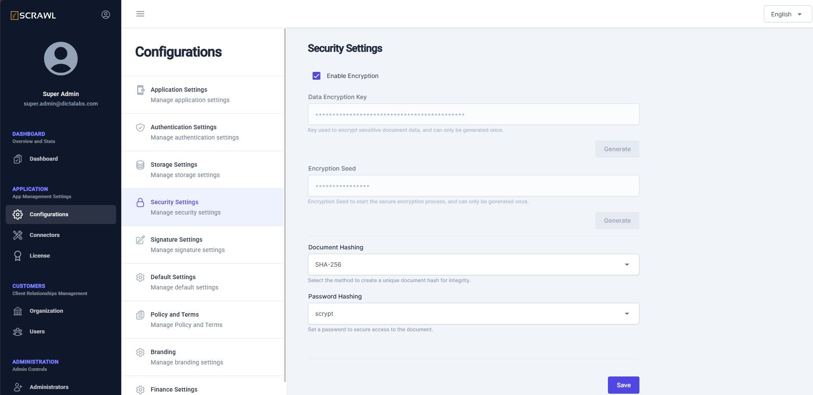

# Security Settings  

The **Security Settings** screen allows administrators to configure encryption and hashing settings for user data and documents.  

## Key Features  
- Choose encryption settings for **user data** and **documents**.  
- Configure **hashing** settings to enhance security.   

> **Note:** Right after a new installation, come to this screen and enable encryption.  Create "Data Encryption Key" and "Encryption Seed" by clicking respective Generate buttons.

