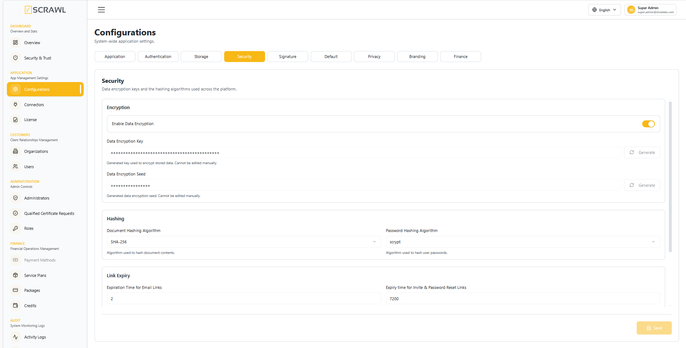

# Security   

The **Security** screen allows administrators to configure encryption and hashing for user data and documents, and how long the links sent by email stay valid.  

The screen is divided into the following sections.

## Encryption  
- **Enable Data Encryption** – Turns encryption of sensitive document data on. The key and seed fields below only appear once this is ticked.  
- **Data Encryption Key** – The key used to encrypt sensitive document data. Click **Generate** to create it.  
- **Data Encryption Seed** – The seed that starts the secure encryption process. Click **Generate** to create it.  

Both values **can only be generated once**. As soon as a value exists, its **Generate** button is greyed out, because regenerating it would make the already encrypted data unreadable.

> **Note:** Right after a new installation, come to this screen, tick **Enable Data Encryption**, and create the **Data Encryption Key** and **Data Encryption Seed** by clicking their respective **Generate** buttons — before any documents are uploaded.

## Hashing  
- **Document Hashing Algorithm** – The method used to create a unique hash of a document so that any later change to it can be detected.  
- **Password Hashing Algorithm** – The algorithm used to store user passwords in hashed form.  

## Link Expiry  
These settings control how long a link sent by email keeps working. Both values are in **minutes**.

- **Expiration Time for Email Links** – How long the links shared with recipients by email remain valid, for example the link that opens a document for signing.  
- **Expiry time for Invite & Password Reset Links** – How long an invitation link or a password reset link remains valid.  

Once a link expires the recipient sees a "link expired" page and has to be sent a new one, so set a window that is long enough for your signers to react.

Click **Save** to apply the changes.
