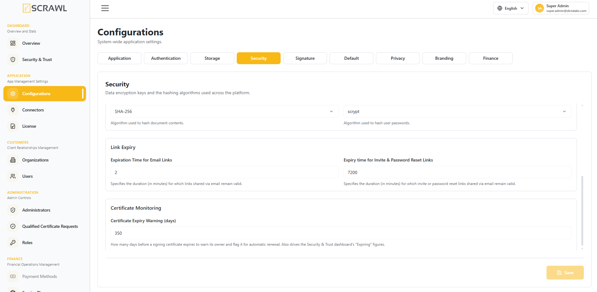

# Security   

The **Security** screen allows administrators to configure encryption and hashing for user data and documents, how long the links sent by email stay valid, and how early signing certificates are reported as expiring.  

The screen is divided into the following sections.

## Encryption  
- **Enable Data Encryption** – Turns encryption of sensitive document data on. The key and seed fields below only appear once this is ticked.  
- **Data Encryption Key** – The key used to encrypt sensitive document data. Click **Generate** to create it.  
- **Data Encryption Seed** – The seed that starts the secure encryption process. Click **Generate** to create it.  

Both values **can only be generated once**. As soon as a value exists, its **Generate** button is greyed out, because regenerating it would make the already encrypted data unreadable.

> **Note:** Right after a new installation, come to this screen, tick **Enable Data Encryption**, and create the **Data Encryption Key** and **Data Encryption Seed** by clicking their respective **Generate** buttons — before any documents are uploaded.

## Hashing  
- **Document Hashing Algorithm** – The method used to create a unique hash of a document so that any later change to it can be detected.  
- **Password Hashing Algorithm** – The algorithm used to store user passwords in hashed form.  

## Link Expiry  
These settings control how long a link sent by email keeps working. Both values are in **minutes**.

- **Expiration Time for Email Links** – How long the links shared with recipients by email remain valid, for example the link that opens a document for signing.  
- **Expiry time for Invite & Password Reset Links** – How long an invitation link or a password reset link remains valid.  

Once a link expires the recipient sees a "link expired" page and has to be sent a new one, so set a window that is long enough for your signers to react.

## Certificate Monitoring  
- **Certificate Expiry Warning (days)** – How many days before a signing certificate expires vScrawl should start treating that certificate as *expiring soon*.  

This single value drives both the warnings your users receive and the numbers the platform reports:

- **Warning and automatic renewal** – Once a day vScrawl looks for **AES** signing certificates that expire inside this window, notifies the user who owns each one, and flags it for automatic renewal. The renewal itself happens the next time that user signs a document — never from the admin console. Certificates that are already revoked are skipped, because they need replacing rather than renewing.  
- **When the package cannot pay for it** – If the owner's organization no longer has the credits to cover a renewal, the certificate is still flagged and the owner is still notified, but the renewal is held back until the package is topped up.  
- **Security & Trust dashboard** – The **Expiring** and **Renewals Needed** figures on the [Security & Trust Infrastructure](security_trust.md) page count certificates against this same window, so the dashboard always reports the same certificates your users were warned about.  

Each user is notified once per certificate per expiry date, so a wide window does not mean a nightly reminder — a fresh notice is only raised once the certificate has been renewed and a new expiry date applies.

Enter a whole number of days between **1** and **3650**; a value outside that range is refused when saving. If the setting has never been saved, vScrawl behaves as though it were **30** days.

> **Note:** A wider window gives signers more time to renew before their certificate lapses, but also makes the **Expiring** count on the Security & Trust dashboard larger. A narrower window keeps that count small at the cost of a shorter runway.

Click **Save** to apply the changes.
