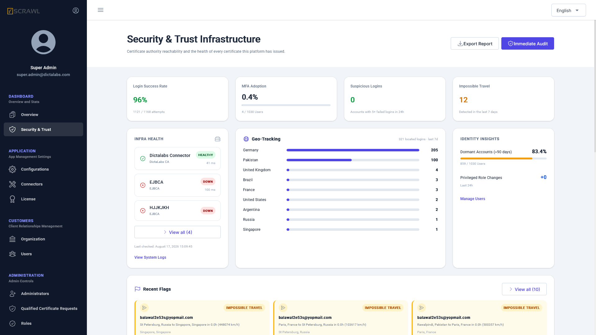
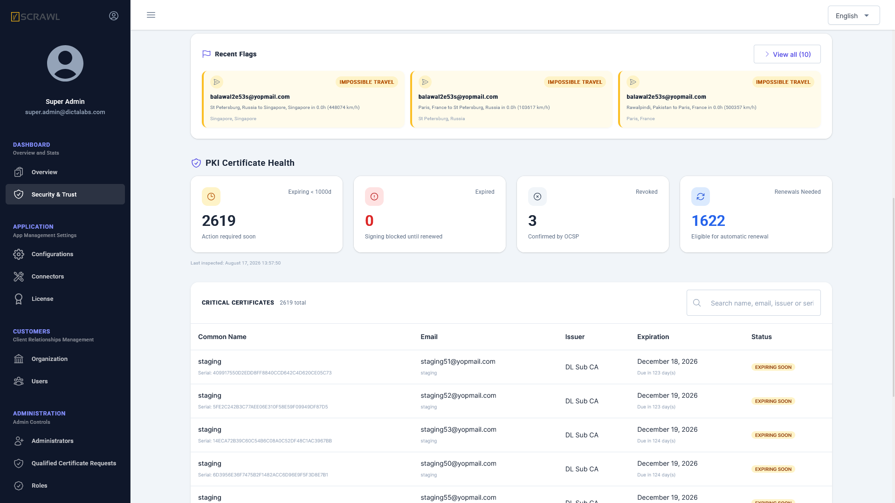

# Security & Trust Infrastructure

**Security & Trust Infrastructure** is a read-only dashboard for checking, in one place, whether the certificate authorities the platform depends on are reachable, whether users' signing certificates are healthy, and whether anything about login or identity activity looks suspicious. Nothing on this page performs an action against a user, certificate, or connector — it only reports what the platform has already observed.

## Accessing the Page

1. Log in to the admin console.
2. From the left navigation menu, under **Dashboard**, click **Security & Trust**.

## Overview Cards

Four headline figures sit at the top of the page:

- **Login Success Rate** – successful logins as a percentage of all login attempts over a rolling 30‑day window. Reads green at 95% or above, amber between 85–94.9%, and red below 85%.
- **MFA Adoption** – the percentage of active users with multi-factor authentication enabled. This is read live from Keycloak (not the app's own settings), so it also picks up anyone who enrolled MFA directly in Keycloak.
- **Suspicious Logins** – the number of distinct accounts with 5 or more failed login attempts in the last 24 hours.
- **Impossible Travel** – logins from the same account, in the last 7 days, whose implied travel speed between two consecutive locations exceeds normal air travel (over 1,000 km/h). Reads green at 0.

If login events aren't being recorded yet, Login Success Rate and Suspicious Logins show a dash instead of 0% — a genuine all-clear looks different from "nothing has been measured."

## Infra Health

Lists every active certificate authority (CA) connector configured on the platform, with its status and last response time:

- **Healthy** – the connector answered successfully.
- **Warning** – the connector answered but not successfully, or is missing required configuration.
- **Down** – the connector could not be reached at all.
- **Unknown** – this connector type isn't actively health-checked, or hasn't been probed yet.

Connectors are re-checked automatically every 5 minutes. **View System Logs** opens the platform's [Activity Logs](activity_logs.md) screen.

## Geo-Tracking

Shows where successful logins are coming from over the last 7 days, as a ranked list of countries by login count.

If no GeoIP provider is configured, this panel shows "Requires a GeoIP provider" instead of an empty chart, so a real all-clear is never confused with a missing dependency.

## Identity Insights

- **Dormant Accounts** – active users with no recorded activity in the last 90 days, shown as a percentage of all active users.
- **Privileged Role Changes** – role additions, updates, deletions, or permission changes made by administrators in the last 24 hours.
- **MFA Adoption Trend** – appears once enough history exists to compare against, showing whether MFA adoption has moved up or down since the last comparison point.

## Recent Flags

A combined, most-recent-first list of two kinds of activity that may need a closer look:

- **Impossible Travel** – the same account logging in from two locations too far apart to have been reached by normal travel in the time between them.
- **Failed Login Burst** – an account with several failed login attempts in a short period.

!!! note ""
    The **Suspicious Logins** figure in the overview cards looks at the last 24 hours only, while **Failed Login Burst** entries here look back over the last 7 days — so an account flagged here may not always be reflected in that overview count, and vice versa.

## PKI Certificate Health

Below the identity section, four cards summarize the health of every signing certificate the platform has issued:

- **Expiring** – certificates due to expire within the configured warning window (default 30 days, set under **General Settings → Certificate Expiry Warning**).
- **Expired** – certificates already past their expiry date; signing is blocked until renewed.
- **Revoked** – certificates confirmed revoked by an OCSP check.
- **Renewals Needed** – expiring certificates whose organization is eligible for automatic renewal on the user's next sign.

### Critical Certificates Table

Lists every expiring, expired, or revoked certificate, with Common Name, Email, Issuer, Expiration, and Status. The table is searchable (across name, email, issuer, and serial number) and sortable by Common Name, Email, Issuer, or Expiration. There is no action column — renewal always happens through the certificate owner signing, never from this screen.

## Running an Immediate Audit

Click **Immediate Audit** to force everything on the page to refresh right away, instead of waiting for its normal schedule. This re-checks CA connector reachability, re-parses certificate data, re-queries revocation status for every certificate, and clears the cached MFA count.

The button shows **Running Audit…** while in progress. A typical audit finishes in a few seconds, but can take longer on a large certificate estate or if a certificate authority is slow to respond. **Last audited** updates once the run finishes, even if nothing changed — so a no-op audit is still visibly a completed check.

!!! note ""
    Immediate Audit does not send renewal notifications to end users. That stays on its own daily schedule so operators can check this page freely without triggering emails to the entire user base.

## Exporting a Report

Click **Export Report** to download a CSV snapshot of exactly what's currently on screen — Infra Health, PKI Certificate Health (including the critical certificates list), and Identity Insights. Exporting does not re-check anything; it reports the same cached figures visible on the page at the time of export.
