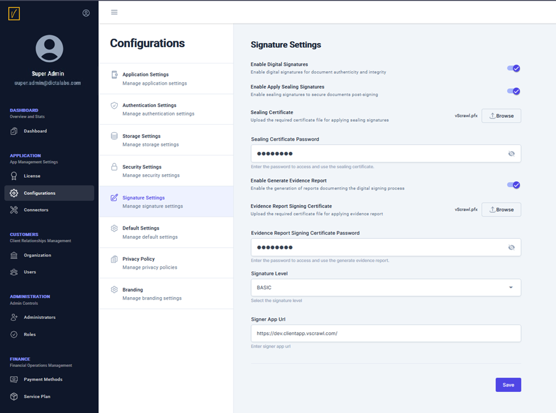

# Signature Settings  

Use the **Signature Settings** screen to configure various signature options within the vScrawl application.  

## Key Features  
- **Enable Digital Signatures**: Enable digital signatures to be applied on user documents.  
- **Enable Apply Sealing Signatures**: Choose this option to apply a post-sign company seal on user documents for added security.  
- **Sealing Certificate**: Specify the certificate to be used for the sealing signature.  
- **Sealing Certificate Password**: Enter the password for the sealing certificate.  
- **Enable Generate Evidence Report**: Select this option to generate a digitally signed evidence report that records who shared the document, who signed it, the time of signing, and the signing method used.  
- **Evidence Report Signing Certificate**: Specify the certificate to sign the evidence report.  
- **Evidence Report Signing Certificate Password**: Enter the password for the evidence report signing certificate.  
- **Signature Level**: Choose whether the digital signatures will be basic or timestamped signatures.