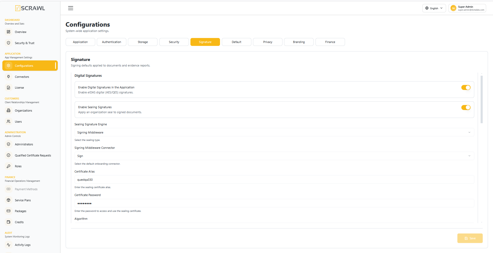
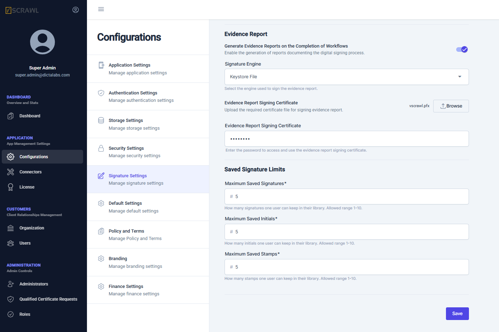
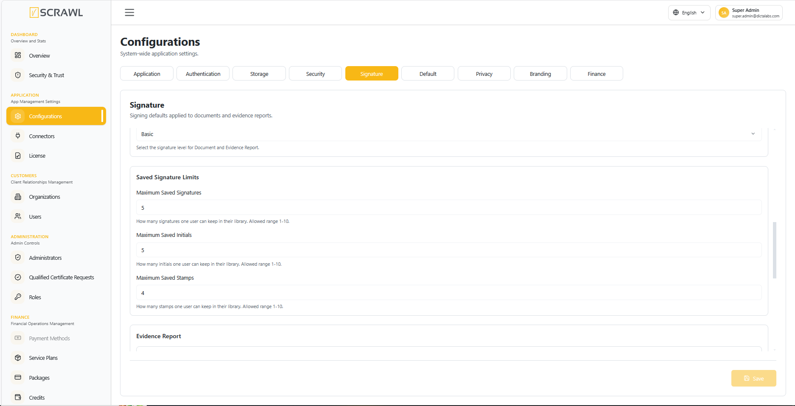

# Signature 

Use the **Signature** screen — the **Signature** tab of **Configurations** — to configure how vScrawl signs documents and the evidence reports that go with them.  

The screen is divided into the following sections.

## Digital Signatures  

- **Enable Digital Signatures in the Application** – Enables eIDAS digital (AES/QES) signatures for document authenticity and integrity. This option is only shown when the installed license enables **eIDAS** mode; without it, it is saved as off.  
- **Enable Sealing Signatures** – Applies a post-sign organization seal on signed documents for added security. Turning it on reveals the engine that produces the seal.  

!!! warning ""
    **Enable Digital Signatures in the Application** is a platform-wide switch. While it is off, AES and QES are not offered to any user and any attempt to sign with them is refused — whatever their [service plan](../finance_settings/service_plans.md) allows. Only simple electronic signatures (SES) remain available.

### Sealing Signature Engine  
Choose the engine used to apply the sealing signature. The fields underneath change with the engine you pick:

- **Keystore File** – Upload the **Sealing Certificate** (a PFX file) and enter its **Sealing Certificate Password**.  
- **Signing Middleware** – Select the **Signing Middleware Connector**, then provide the **Certificate Alias**, the **Certificate Password** and the **Algorithm** (for example `SHA256withRSA`).  
- **Crypto Engine** – Select the **Crypto Engine Connector**, then provide the **Certificate Alias**, the **Certificate Password**, the **Algorithm** and upload the **Sealing Certificate Chain (.p7b)**.  

For **Signing Middleware** and **Crypto Engine** the connector, alias, password and algorithm are required, and the tab is not saved until they are filled in. For **Keystore File** the file must be a PFX or P12 certificate, and its password is required whenever a new file is selected. The same rules apply to the evidence report's engine below.

The Signing Middleware and Crypto Engine options read their server details from a **Sign** connector, so the connector has to exist first — see [Add Connectors](../connectors/add_connectors.md#sign-connectors).

### Signature Process  
Choose the level applied to both the document and the evidence report:

- **Basic** – The signature is applied without a trusted timestamp.  
- **LTV** – Long Term Validation. The signature is timestamped so that it can still be validated long after the signing certificate expires.  

### TSA Connector  
This dropdown only appears when the Signature Process is **LTV**, and it is required in that case. Select the **Timestamp** connector that provides the Time Stamping Authority used for the timestamps.

The TSA server address and its credentials are configured on the connector itself, not on this page — see [Timestamp Connectors](../connectors/add_connectors.md#timestamp-connectors). Add the connector first, then come back here and select it.

## Evidence Report  

- **Generate Evidence Report** – Attaches a digitally signed evidence report to completed documents, recording who shared the document, who signed it, the time of signing, and the signing method used. Turning it on reveals the engine that signs the report.  
- **Signature Engine** – The engine used to sign the evidence report. The same three options are available as for the sealing signature — **Keystore File**, **Signing Middleware** and **Crypto Engine** — each with its own set of certificate fields.  

## Saved Signature Limits

Every user keeps their own library of saved signatures, initials and stamps, and applies the right one to each field they sign. Use this section to control how large those libraries may grow.

- **Maximum Saved Signatures**: How many signatures one user can keep in their library.
- **Maximum Saved Initials**: How many sets of initials one user can keep in their library.
- **Maximum Saved Stamps**: How many stamps one user can keep in their library.

Each list is capped separately and the allowed range is **1–10** (the default is **5**). When a user reaches the limit, they must delete an item before saving another. Lowering a limit never deletes anything a user has already saved.

## Remote Signature Service onboarding
The settings that enrol users into the Remote Signature Service — **Onboard Users for Remote Signature Service** and **Admin Approval is Required for Onboarding** — are configured in the [User Onboarding](authentication_settings.md#user-onboarding) section of the Authentication Settings page.
