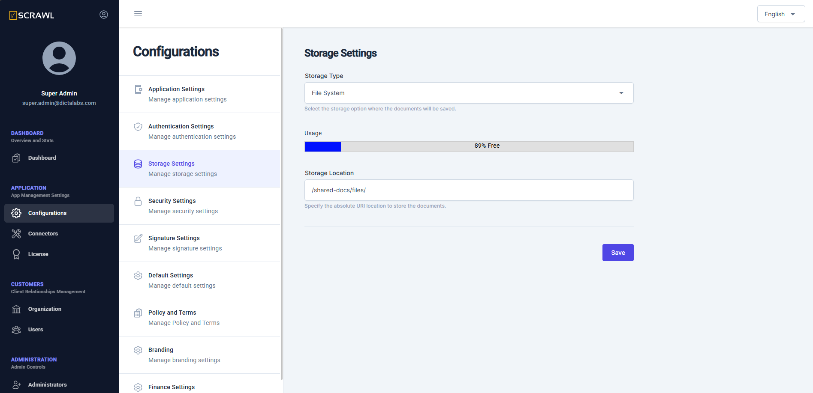

# Storage Settings  

The **Storage Settings** screen allows administrators to configure document storage and retrieval settings for vScrawl.  

## Key Features  
- Configure a **Storage Type**, currently only File System is supported.  
- Set a **Storage Location** for storing and retrieving the documents.  
- Monitor the **storage usage**, showing:  
  - The percentage of allocated storage that has been consumed.  
  - The remaining storage available.   
