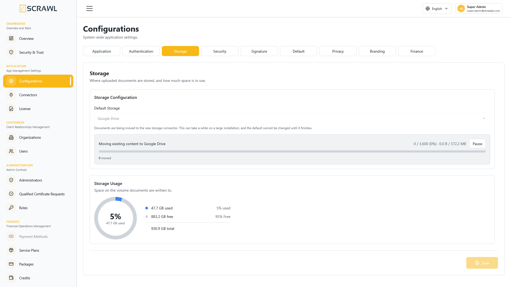

# Storage  

The **Storage Settings** screen allows administrators to configure document storage and retrieval settings for vScrawl.  

## Storage Configuration  
- **Storage Type** – The storage option where the documents are saved. Currently only **File System** is supported.  
- **Storage Location** – The absolute URI of the folder used to store and retrieve the documents.  

Click **Save** to apply the changes.

## Usage  
The **Usage** panel reports how much disk space is left on the server, so that an administrator can act before it fills up. It shows:

- A **donut chart** with the percentage of the volume that is already in use.
- **Used**, **Free** and **Total** space, in GB.
- A bar underneath repeating the same proportion at a glance.

The donut and the bar change colour as the volume fills up, so the state is visible without reading the numbers:

| Used space | Colour |
| --- | --- |
| Up to 60% | Blue — healthy |
| Above 60% and up to 85% | Amber — keep an eye on it |
| Above 85% | Red — free up space or extend the volume |

> **Note:** The figures describe the server's root file system as a whole, not only the documents stored by vScrawl. If the Storage Location is mounted on a separate volume, check that volume on the server itself.
