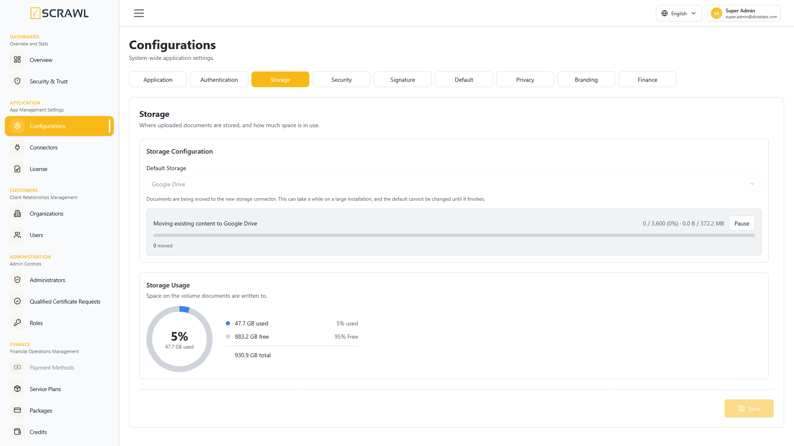

# Storage

The **Storage** screen decides where uploaded documents are kept, and shows how much room is left where they are kept.

## Storage Configuration

- **Default Storage** – the connector documents are written to.

Every option in this dropdown is a **Storage connector**, including the platform's own volume, which is seeded as a connector named **Server Storage**. There is no separate storage type or path on this screen: where a place is and how it is reached — its directory — belongs to the connector. See [Add Connectors](../connectors/add_connectors.md#storage-connectors) for how to add one.

Only connectors that are **Active** and whose last health check passed are offered. A connector that has been switched off, or that failed its last check, is not something documents should be sent to.

### Only the platform's own volume can be the default

The dropdown lists **Server Storage** connectors and nothing else. Documents this installation holds are not written out to a Google Drive or Dropbox account.

The rule is enforced by the server as well as by the screen, so it cannot be worked around by calling the API directly.

!!! note "Cloud Source is the other direction, and is unaffected"
    Google Drive and Dropbox are still available under the **Cloud Source** purpose, where a signer brings one of their own files *in*. What is withdrawn here is the opposite — this platform pushing the documents it holds *out* to an account outside the installation. See [Set Up Cloud Source Providers](../connectors/cloud_source_setup.md).

### Changing the default

A new default applies to **documents written from that point on**. Content already stored stays where it is and stays readable from the connector that holds it — changing this setting never moves, copies or deletes anything.

Adding a second Server Storage connector with a different Storage Location is therefore how you move onto a new volume for new content, not how you empty the old one.

> **Note:** A connector that still holds documents or templates cannot be deleted, and neither can the one currently set as the default. Deleting a connector does not delete the content — it deletes the only record of where that content is.

## Storage Usage

The **Storage Usage** panel reports space on the volume the **currently selected connector** keeps documents on, so the figures change when the default storage changes.

- A **donut chart** with the proportion in use.
- **Used**, **Free** and **Total** space, scaled to a sensible unit — MB for a fraction of a gigabyte, TB for a large volume.

The donut changes colour as the space fills up, so the state is visible without reading the numbers:

| Used space | Colour |
| --- | --- |
| Up to 60% | Blue — healthy |
| Above 60% and up to 85% | Amber — keep an eye on it |
| Above 85% | Red — free up space or extend the volume |

> A volume that holds something but too little to round to a whole percent reads as **<1%**, not `0%`. Zero would say nothing is stored, which is a different and wrong answer.
