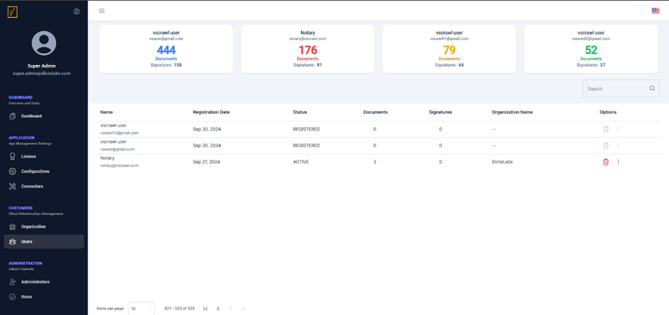
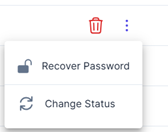
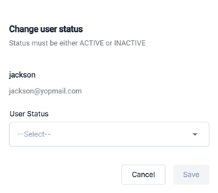

# Users  

Unlike the Organization screen, the Users screen provides not only a view and delete option for all users registered on the vScrawl application but also allows administrators to manage user accounts.
  

An administrator can click on the three dots next to any registered user to recover their password or change the user's status to either Active or Inactive.

Clicking on the three dots shows the following options:

To change the status, click **Change Status**, which will display the following screen:

From the dropdown, select the user status as **ACTIVE** or **INACTIVE**.