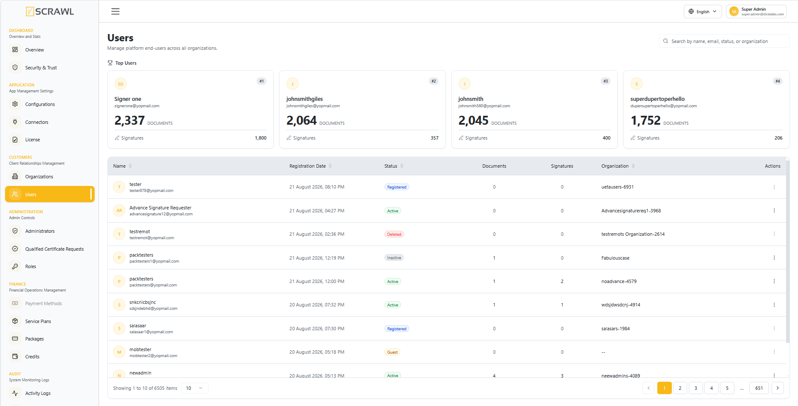
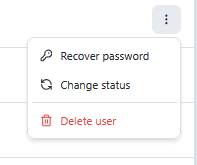
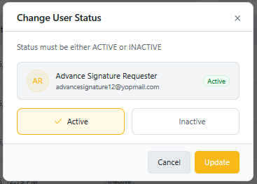

# Users  

Unlike the Organization screen, the Users screen — **Users** under **CUSTOMERS** in the left navigation pane — provides not only a view and delete option for all users registered on the vScrawl application but also allows administrators to manage user accounts. The list shows each user's **Name**, **Registration Date**, **Status**, number of **Documents** and **Signatures**, and **Organization**.
  

An administrator can click on the three dots under **Actions** next to any registered user to recover their password, change the user's status to either Active or Inactive, or delete the user.

Clicking on the three dots shows the following options:

- **Recover password** – sends the user a password recovery email.
- **Change status** – opens the **Change User Status** dialog.
- **Delete user** – permanently deletes the user after a confirmation. What a deletion removes is decided by **Erase personal data on deletion** — see [Application → Account deletion](application_settings.md#account-deletion). A user who owns an organization that still has other members cannot be deleted until ownership is transferred to another member.

To change the status, click **Change status**, which will display the following screen:

From the pop up, select the user status as **Active** or **Inactive**, then click **Update**.