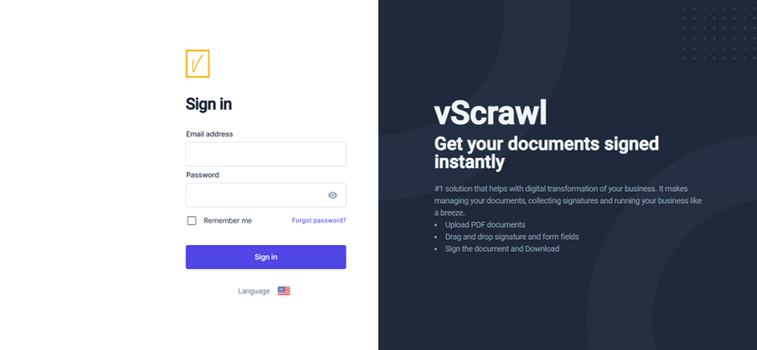
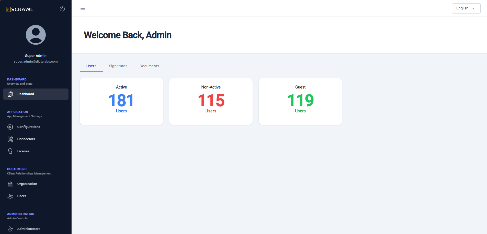

# Access the vScrawl Admin Console

The default administrator can access the vScrawl Admin login page using the URL configured for vScrawl Admin during the deployment:  
[https://admin.example.com](https://admin.example.com)  

### Login Process
1. Navigate to the login page at the URL above.
2. Enter the default operator login credentials.  Get these credentials from your solution provider.
3. Click the **Sign In** button to access the admin console.

---

### Admin Console Dashboard
Upon successful login, the **vScrawl Admin Console Dashboard** is displayed, providing high-level details such as:

- **Number of Signing Users**
- **Signatures**
- **Documents**  

These details are presented in separate tabs for easy navigation.

---

### Recommended Initial Steps
To ensure secure and efficient administrative access, follow these steps:

1. **Create a new role** and an administrator to replace the default administrator account.
2. **Set up mandatory connectors** for external service providers, including:

   - Email server
   - Signing service  

These configurations can be managed in the **Application > Configurations > Default Settings** screen.

---

The initial chapters of this guide cover these configurations in detail, while later sections provide information about additional administrative options.