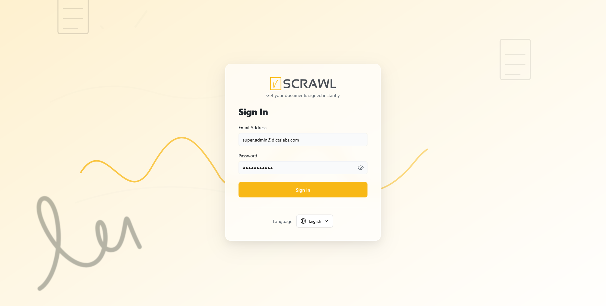
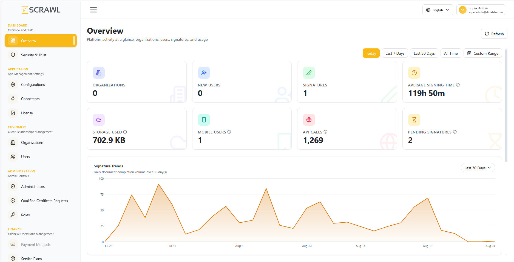

# Access the vScrawl Admin Console

The default administrator can access the vScrawl Admin login page using the URL configured for vScrawl Admin during the deployment:  
[https://admin.example.com](https://admin.example.com)  

### Login Process
1. Navigate to the login page at the URL above.
2. Enter the default operator login credentials.  Get these credentials from your solution provider.
3. Click the **Sign In** button to access the admin console.

---

### Admin Console Dashboard
Upon successful login, the **vScrawl Admin Console Dashboard** is displayed, providing an at-a-glance view of platform activity.

**Overview cards** have their own date filter — **Today, Last 7 Days, Last 30 Days, All Time, or a Custom Date Range** — independent of the Users & Workflow filter further down the page. Every card below reflects whichever period is currently selected:

- **Organizations** — organizations created in the selected period
- **New Users** — new user accounts created in the selected period
- **Signatures** — signatures applied in the selected period
- **Average Signing Time** — average time from a workflow being created to being completed, for workflows completed in the selected period
- **Storage Used** — disk space occupied by documents written to disk in the selected period
- **Mobile Users** — distinct users seen on a mobile client in the selected period (consent capture, signing/viewing/uploading a document, or logging in/registering from the mobile app)
- **API Calls** — total platform activity in the selected period (signing, uploads, logins, etc.), across every service, not just Admin
- **Pending Signatures** — signature requests still awaiting a recipient, sent or self-signed within the selected period

Cards with an info icon show a tooltip explaining exactly how that number is calculated. Switching the Overview filter re-fetches all eight cards together.

**Signature Trends** shows daily signature volume as a line chart, toggleable between **Last 30 Days** and **Last 90 Days**. Hovering over the chart shows the exact date and count for that day.

**Live Activity** lists the 3 most recent activity log entries, with a **View All** link to the full Activity Logs screen.

**Users & Workflow** shows two breakdown cards — Users (Active, Registered, Inactive, Guest) and Workflow (Sent, Draft, Completed, Void) — each as a donut chart with counts and percentages. This section has its own separate date filter from the Overview cards above: **Current Month, Last Month, Last 3 Months, Current Year, All Time, or a Custom Date Range**.

---

### Recommended Initial Steps
To ensure secure and efficient administrative access, follow these steps:

1. **Create a new role** and an administrator to replace the default administrator account.
2. **Set up mandatory connectors** for external service providers, including:

   - Email server
   - Signing service  

These configurations can be managed in the **Application > Configurations > Default Settings** screen.

---

The initial chapters of this guide cover these configurations in detail, while later sections provide information about additional administrative options.